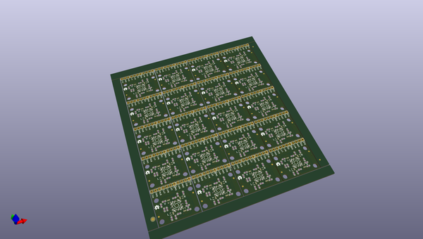
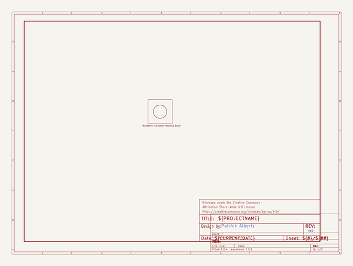
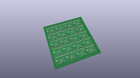
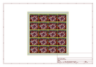
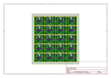
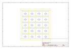
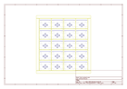
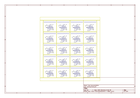

# OOMP Project  
## Blackberry_Trackballer_Breakout  by sparkfun  
  
(snippet of original readme)  
  
**NOTE:** *This product has been retired from our catalog. If you are looking for more up-to-date info, please check out some of these resources to see how other users are still hacking and improving on this product.*  
* *[SparkFun Forum](https://forum.sparkfun.com/)*  
* *[Comments Here on GitHub](https://github.com/sparkfun/Blackberry_Trackballer_Breakout/issues)*  
* *[IRC Channel](https://www.sparkfun.com/news/263)*  
  
SparkFun BlackBerry Trackballer Breakout  
========================================  
  
  
  
[*SparkFun BlackBerry Trackballer Breakout (COM-13169)*](https://www.sparkfun.com/products/13169)  
  
The SparkFun BlackBerry Trackballer Breakout gives you easy access to a trackball which measures up, down, left, and right movements, clicks on the board, as well as adding a bit of flair to your project with four built-in LEDs. The trackballer breakout can be hooked into an Arduino compatible device to provide you with an intuitive direction controller.  
  
Repository Contents  
-------------------  
   
* **/Firmware** - Example Arduino code   
* **/Hardware** - Eagle design files (.brd, .sch) for the main PCB, and the mounting PCB.   
* **/Production** - Production panel files (.brd) for the main PCB. The mounting PCB did not need to be panelized.   
  
Documentation  
--------------  
* **[Hookup Guide](https://learn.sparkfun.com/tutorials/blackberry-trackballer-breakout-hookup-guide)** - Basic h  
  full source readme at [readme_src.md](readme_src.md)  
  
source repo at: [https://github.com/sparkfun/Blackberry_Trackballer_Breakout](https://github.com/sparkfun/Blackberry_Trackballer_Breakout)  
## Board  
  
  
## Schematic  
  
  
  
[schematic pdf](working_schematic.pdf)  
## Images  
  
  
  
  
  
  
  
  
  
  
  
  
  
  
  
  
