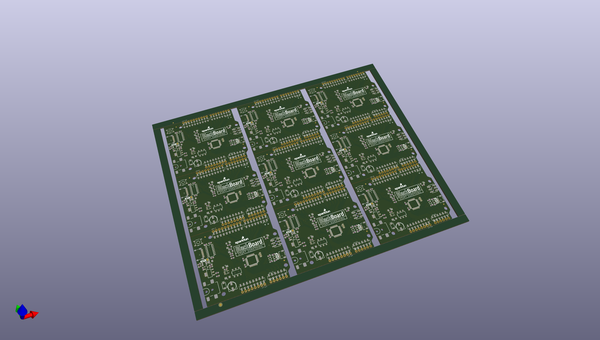
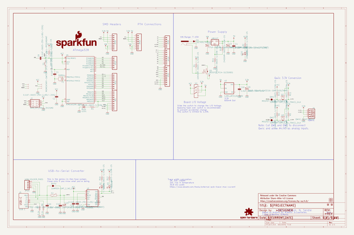
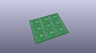
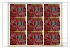
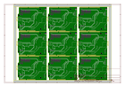
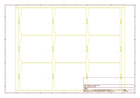
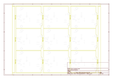
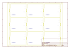
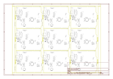

# OOMP Project  
## BlackBoard  by sparkfun  
  
(snippet of original readme)  
  
SparkFun BlackBoard  
============================  
  
[    
*SparkFun BlackBoard (SPX-14669)*](https://www.sparkfun.com/products/14669)  
  
The BlackBoard from SparkFun is everything you need in an Arduino Uno with *many* extra perks. BlackBoard has all of the hardware peripherals you know and love: 14 Digital I/O pins with 6 PWM pins, 6 Analog Inputs, UART, SPI and external interrupts. BlackBoard even has an SMD ISP header to connect SPI pins to shields.  
  
We've applied every lesson we've learned about making a better Uno and created the BlackBoard. The USB to serial is now done with the ubiquitous CH340G requiring fewer driver installs and a rock solid microB connector with through hole anchoring. The power portion of the BlackBoard has been reworked: we upgraded the 3.3V regulator to provide up to 600mA, with full thermal and reverse circuit protection, and added extra decoupling capacitance to increase the sensitivity of the ADC readings. We've decreased the brightness of the power, 13, and TX/RX LEDs from blinding to just perfect. We've added 3.3V voltage translation and a [Qwiic connector](https://www.sparkfun.com/qwiic) to the edge of the board to allow for quick and seamless connection to our ever-growing line of I2C based [Qwiic](https://www.sparkfun.com/qwiic) products.   
  
And for more advanced users we've added a 3.3V/5V I/O jumper. Cut the trace to 5V and solder a jumper   
  full source readme at [readme_src.md](readme_src.md)  
  
source repo at: [https://github.com/sparkfun/BlackBoard](https://github.com/sparkfun/BlackBoard)  
## Board  
  
  
## Schematic  
  
  
  
[schematic pdf](working_schematic.pdf)  
## Images  
  
  
  
  
  
  
  
  
  
  
  
  
  
  
  
  
