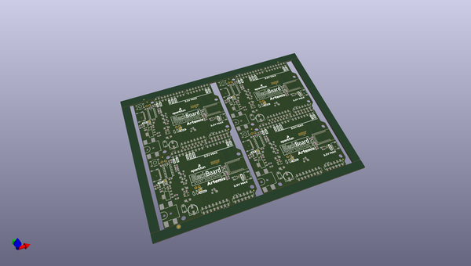

# OOMP Project  
## BlackBoard_Artemis  by sparkfun  
  
(snippet of original readme)  
  
**NOTE:** *This product has been retired from our catalog. There is an updated RedBoard version available: [DEV-15444](https://www.sparkfun.com/products/15444). If you are looking for more up-to-date info, please check out some of these resources to see how other users are still hacking and improving on this product version.*  
  
* *[SparkFun Artemis Forum](https://forum.sparkfun.com/viewforum.php?f=167)*  
* *[Comments Here on GitHub](https://github.com/sparkfun/BlackBoard_Artemis/issues)*  
  
SparkFun BlackBoard Artemis  
============================  
  
[    
*SparkFun BlackBoard (SPX-15332)*](https://www.sparkfun.com/products/15332)  
  
Think of the BlackBoard Artemis as just another Arduino... That has BLE. And one meg of flash. And runs at less than 1mA. Oh, and it can run TensorFlow models. Ya, that too. The BlackBoard Artemis takes the incredibly powerful Artemis module from SparkFun and wraps it up in an easy to use and familiar Uno footprint. We've written an Arduino core from scratch to make programming the Artemis as familiar as `Serial.begin(9600)`. Time-to-first-blink is less than five minutes.  
  
The BlackBoard Artemis has the improved power conditioning and USB to serial that we've refined over the years on our BlackBoard line of products. A modern USB-C connector makes programming easy. A Qwiic connector makes I2C easy. The BlackBoard Artemis is fully compat  
  full source readme at [readme_src.md](readme_src.md)  
  
source repo at: [https://github.com/sparkfun/BlackBoard_Artemis](https://github.com/sparkfun/BlackBoard_Artemis)  
## Board  
  
  
## Schematic  
  
  
  
[schematic pdf](working_schematic.pdf)  
## Images  
