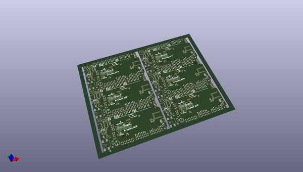

# OOMP Project  
## BlackBoard_Artemis_ATP  by sparkfun  
  
(snippet of original readme)  
  
**NOTE:** *This product has been retired from our catalog. There is an updated RedBoard version available: [DEV-15442](https://www.sparkfun.com/products/15442). If you are looking for more up-to-date info, please check out some of these resources to see how other users are still hacking and improving on this product version.*  
  
* *[SparkFun Artemis Forum](https://forum.sparkfun.com/viewforum.php?f=167)*  
* *[Comments Here on GitHub](https://github.com/sparkfun/BlackBoard_Artemis_ATP/issues)*  
  
SparkFun BlackBoard Artemis ATP  
============================  
  
  
  
[*SparkFun BlackBoard Artemis ATP (SPX-15412)*](https://www.sparkfun.com/products/15412)  
  
The BlackBoard Artemis ATP is affectionately called 'All the Pins!' at SparkFun. The Artemis module has 48 GPIO and this board breaks out absolutely every one of them in a familiar Mega like form factor. What's with the silkscreen labels? They're all over the place. We decided to label the pins as they are assigned on the Apollo3 IC itself. This makes finding the pin with the function you desire a lot easier. Have a look at the [full pin map](https://cdn.sparkfun.com/assets/8/2/3/3/c/Apollo3_Pad_Mapping.pdf) from the Apollo3 datasheet. If you really need to test out the 4-bit SPI functionality of the Artemis you're going to need to access pins 4, 22, 23, and 26. Need to try out the differential ADC port 1? Pins 14 and 15.  
  full source readme at [readme_src.md](readme_src.md)  
  
source repo at: [https://github.com/sparkfun/BlackBoard_Artemis_ATP](https://github.com/sparkfun/BlackBoard_Artemis_ATP)  
## Board  
  
  
## Schematic  
  
  
  
[schematic pdf](working_schematic.pdf)  
## Images  
