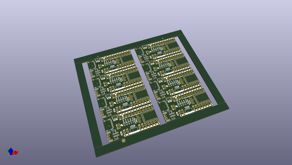

# OOMP Project  
## BlackBoard_Artemis_Nano  by sparkfun  
  
(snippet of original readme)  
  
**NOTE:** *This product has been retired from our catalog. There is an updated RedBoard version available: [DEV-15443](https://www.sparkfun.com/products/15443). If you are looking for more up-to-date info, please check out some of these resources to see how other users are still hacking and improving on this product version.*  
  
* *[SparkFun Artemis Forum](https://forum.sparkfun.com/viewforum.php?f=167)*  
* *[Comments Here on GitHub](https://github.com/sparkfun/BlackBoard_Artemis_Nano/issues)*  
  
SparkFun BlackBoard Artemis Nano  
============================  
  
[    
*SparkFun BlackBoard Artemis Nano (SPX-15411)*](https://www.sparkfun.com/products/15411)  
  
We like to joke the Artemis Nano is a party on the front and business on the back. And that's by design! All the important LEDs, connectors, labels, and buttons are presented on the front for the best user experience with all the supporting circuitry on the rear of the board. The BlackBoard Artemis Nano is a minimal but extremely handy implementation of the Artemis module. A light weight, 0.8mm thick PCB, with on board lipo-battery charging and a Qwiic connector, this board is easy to implement into very small projects. A dual row of ground connections make it easy to add lots of buttons, LEDs, and anything that requires its own GND connection. At the same time, the board is breadboard compatible!   
  
A modern USB-C conn  
  full source readme at [readme_src.md](readme_src.md)  
  
source repo at: [https://github.com/sparkfun/BlackBoard_Artemis_Nano](https://github.com/sparkfun/BlackBoard_Artemis_Nano)  
## Board  
  
  
## Schematic  
  
  
  
[schematic pdf](working_schematic.pdf)  
## Images  
