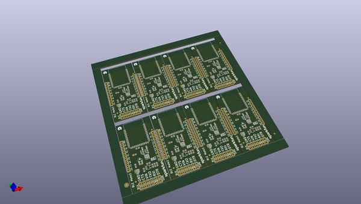
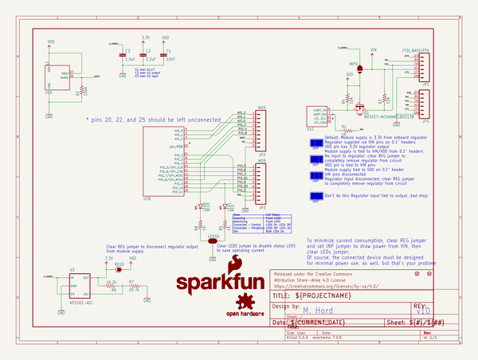

# OOMP Project  
## BLE_Mate2  by sparkfun  
  
(snippet of original readme)  
  
SparkFun BLE Mate 2  
========================================  
  
  
  
[*SparkFun BLE Mate 2 (WRL-13019)*](https://www.sparkfun.com/products/13019)  
  
  
Repository Contents  
-------------------  
  
* **/Arduino** - All Arduino libraries and board examples  
* **/Hardware** - All Eagle design files (.brd, .sch)  
* **/Production** - Test bed files and production panel files  
  
Version History  
---------------  
* [vH10L1.0.0](https://github.com/sparkfun/BLE_Mate2/tree/vH10L1.0.0) - Product version 10, library 1.0.0  
  
  
License Information  
-------------------  
The hardware is released under [Creative Commons ShareAlike 4.0 International](https://creativecommons.org/licenses/by-sa/4.0/).  
The code is beerware; if you see me (or any other SparkFun employee) at the local, and you've found our code helpful, please buy us a round!  
  
Distributed as-is; no warranty is given.  
  
  full source readme at [readme_src.md](readme_src.md)  
  
source repo at: [https://github.com/sparkfun/BLE_Mate2](https://github.com/sparkfun/BLE_Mate2)  
## Board  
  
  
## Schematic  
  
  
  
[schematic pdf](working_schematic.pdf)  
## Images  
