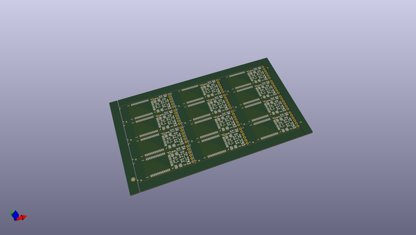
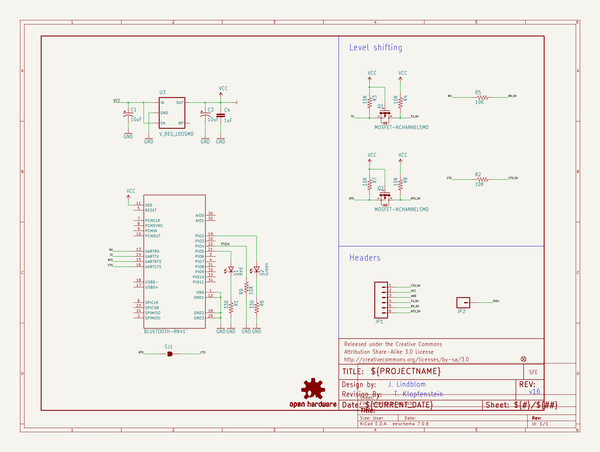
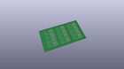
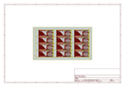
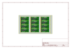
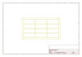
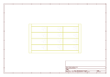
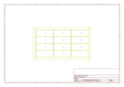
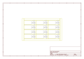

# OOMP Project  
## BlueSMiRF  by sparkfun  
  
(snippet of original readme)  
  
BlueSMiRF  
=========  
  
<table class="table table-hover table-striped table-bordered">  
  <tr align="center">  
   <td></td>  
   <td></td>  
  </tr>  
  <tr align="center">  
    <td><a href="https://www.sparkfun.com/products/12582">Bluetooth BlueSMiRF Gold: RN-41 Module (WRL-12582)</a></td>  
    <td><a href="https://www.sparkfun.com/products/12577">Bluetooth Modem-BlueSMiRF Silver: RN-42 module (WRL-12577)</a></td>  
  </tr>  
</table>  
  
These Bluetooth wireless modems work as a TTL serial (RX/TX) pipe, as a replacement for serial cable connections.   
  
Repository Contents  
-------------------  
* **/Hardware** - All Eagle design files (.brd, .sch)  
  
Documentation  
--------------  
* **[Hookup Guide](https://learn.sparkfun.com/tutorials/using-the-bluesmirf)** - Basic hookup guide for the BlueSMiRF and Bluetooth Mate.  
* **[SparkFun 3D Model repo](https://github.com/sparkfun/3D_Models)** - 3D models of SparkFun products.   
  
Current Product Versions  
------------------------  
* [WRL-12582](https://www.sparkfun.com/products/12582)- BlueSMiRF Gold: RN-41 Module  
* [WRL-12577](https://www.sparkfun.com/products/12577)- BlueSMiRF Silver: RN-42 Module  
  
  
Retired Product Versions  
---------------------  
  full source readme at [readme_src.md](readme_src.md)  
  
source repo at: [https://github.com/sparkfun/BlueSMiRF](https://github.com/sparkfun/BlueSMiRF)  
## Board  
  
  
## Schematic  
  
  
  
[schematic pdf](working_schematic.pdf)  
## Images  
  
  
  
  
  
  
  
  
  
  
  
  
  
  
  
  
