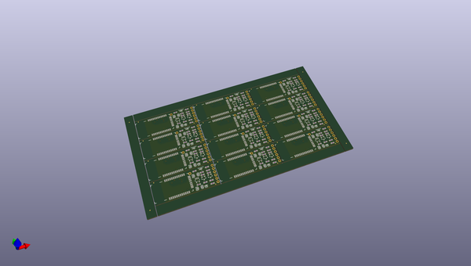
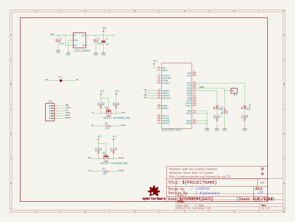
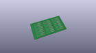
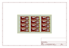
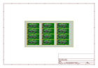
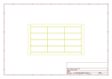
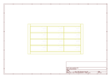
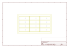
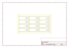

# OOMP Project  
## Bluetooth_Mate  by sparkfun  
  
oomp key: oomp_projects_flat_sparkfun_bluetooth_mate  
(snippet of original readme)  
  
Bluetooth Mate  
==============  
  
<table class="table table-hover table-striped table-bordered">  
  <tr align="center">  
   <td></td>  
   <td></td>  
  </tr>  
  <tr align="center">  
    <td><a href="https://www.sparkfun.com/products/9358">Bluetooth Mate Gold: RN-41 module (WRL-09358)</a></td>  
    <td><a href="https://www.sparkfun.com/products/12576">Bluetooth Mate Silver: RN-42 module (WRL-12576)</a></td>  
  </tr>  
</table>  
  
These bluetooth wireless modems work as a TTL serial (RX/TX) pipe and are designed to mate directly with [Arduino Pro](https://www.sparkfun.com/products/10915), [Pro Mini](https://www.sparkfun.com/products/11114) and [LilyPad](https://www.sparkfun.com/products/9266) boards.   
  
Repository Contents  
-------------------  
  
* **/Hardware** - All Eagle design files (.brd, .sch)  
  
Documentation  
--------------  
* **[Hookup Guide](https://learn.sparkfun.com/tutorials/using-the-bluesmirf)** - Basic hookup guide for the BlueSMiRF and Bluetooth Mate.  
* **[SparkFun 3D Model repo](https://github.com/sparkfun/3D_Models)** - 3D models of SparkFun products.   
  
Product Versions  
----------------  
* [WRL-12576](https://www.sparkfun.com/products/12576)- B  
  full source readme at [readme_src.md](readme_src.md)  
  
source repo at: [https://github.com/sparkfun/Bluetooth_Mate](https://github.com/sparkfun/Bluetooth_Mate)  
## Board  
  
  
## Schematic  
  
  
  
[schematic pdf](working_schematic.pdf)  
## Images  
  
  
  
  
  
  
  
  
  
  
  
  
  
  
  
  
