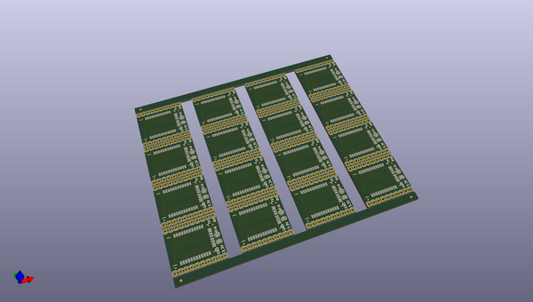
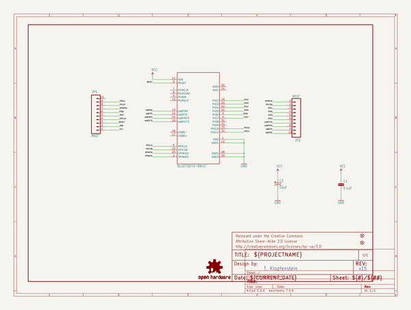
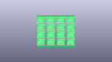
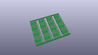
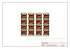
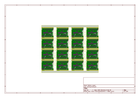
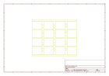
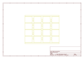
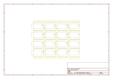

# OOMP Project  
## Bluetooth_Module_Breakout  by sparkfun  
  
oomp key: oomp_projects_flat_sparkfun_bluetooth_module_breakout  
(snippet of original readme)  
  
SparkFun Bluetooth Module Breakout - RN41  
==========================================  
  
    
  
[*SparkFun Bluetooth Module Breakout-RN41 (WRL-12579)*](https://www.sparkfun.com/products/12579)  
  
This is a simple breakout for the Roving Networks RN41 Bluetooth module.   
  
Repository Contents  
-------------------  
* **/Hardware** - All Eagle design files (.brd, .sch)  
* **/Production** - Test bed files and production panel files  
  
  
Product Versions  
----------------  
* [WRL-12579](https://www.sparkfun.com/products/12579)- Version 1.5. Current.   
* [WRL-10559](https://www.sparkfun.com/products/retired/10559)- Version 1.4. Retired.  
  
Version History  
---------------  
* [V_1.5](https://github.com/sparkfun/Bluetooth_Module_Breakout/tree/V_1.5) - GitHub files for version 1.5.   
* [V_1.4](https://github.com/sparkfun/Bluetooth_Module_Breakout/tree/V_1.4) -GitHub files for version 1.4.  
  
License Information  
-------------------  
The hardware is released under [Creative Commons ShareAlike 4.0 International](https://creativecommons.org/licenses/by-sa/4.0/).  
  
Distributed as-is; no warranty is given.  
  
  full source readme at [readme_src.md](readme_src.md)  
  
source repo at: [https://github.com/sparkfun/Bluetooth_Module_Breakout](https://github.com/sparkfun/Bluetooth_Module_Breakout)  
## Board  
  
  
## Schematic  
  
  
  
[schematic pdf](working_schematic.pdf)  
## Images  
  
  
  
  
  
  
  
  
  
  
  
  
  
  
  
  
