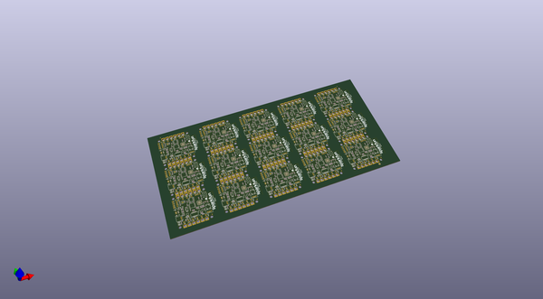
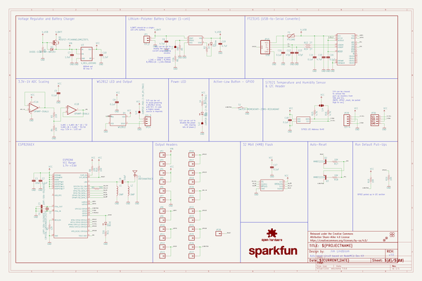
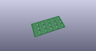
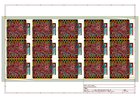
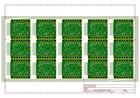
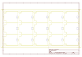
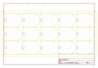
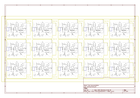

# OOMP Project  
## Blynk_Board_ESP8266  by sparkfun  
  
(snippet of original readme)  
  
SparkFun Blynk Board - ESP8266  
========================================  
  
  
  
[*SparkFun Blynk Board - ESP8266 (WRL-13794)*](https://www.sparkfun.com/products/13794)  
  
The SparkFun Blynk Board is specially designed to work with the [Blynk mobile app](http://blynk.cc), for iOS or Android devices. Combining the Blynk Board with the Blynk app, you'll be able to easily complete a variety of Internet-of-Things (IoT) based projects: control LEDs from your phone! Wire up a door switch and receive phone notifications when it opens or closes. Plug a soil moisture sensor into a plant, and have it tweet at you when it's thirsty!  
  
  
  
All of these projects - and more! - are pre-loaded into the Blynk Board. All you have to do is provision it (using the Blynk app), and start tinkering!  
  
Repository Contents  
-------------------  
  
* **/Firmware** - Blynk Board core firmware and example code.  
* **/Hardware** - Eagle design files (.brd, .sch)  
* **/Production** - Production panel files (.brd)  
  
Documentation  
--------------  
* **[Getting Started Guide](https://learn.sparkfun.com/tutorials/getting-started-with-the-sparkfun-blynk-board)** - Learn how to connect your Blynk Board to Wi-Fi, and start Blyn  
  full source readme at [readme_src.md](readme_src.md)  
  
source repo at: [https://github.com/sparkfun/Blynk_Board_ESP8266](https://github.com/sparkfun/Blynk_Board_ESP8266)  
## Board  
  
  
## Schematic  
  
  
  
[schematic pdf](working_schematic.pdf)  
## Images  
  
  
  
  
  
  
  
  
  
  
  
  
  
  
  
  
