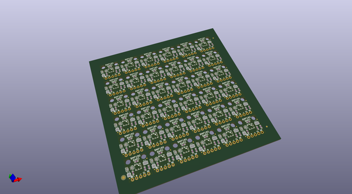
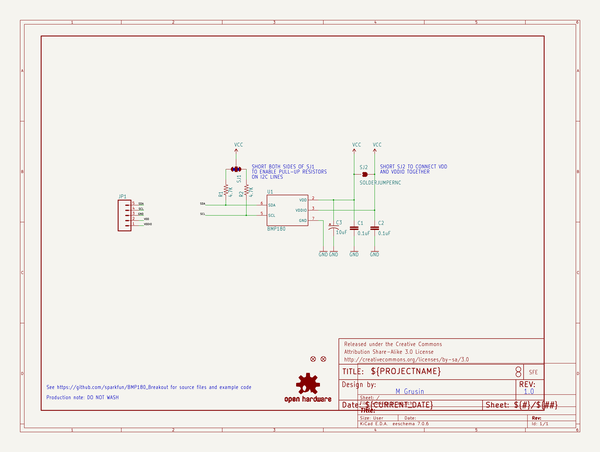

# OOMP Project  
## BMP180_Breakout  by sparkfun  
  
(snippet of original readme)  
  
**NOTE:** *This product has been retired from our catalog. If you are looking for more up-to-date info, please check out some of these resources to see how other users are still hacking and improving on this product.*  
* *[SparkFun Forum](https://forum.sparkfun.com/)*  
* *[Comments Here on GitHub](https://github.com/sparkfun/BMP180_Breakout_Arduino_Library/issues)*  
* *[IRC Channel](https://www.sparkfun.com/news/263)*  
  
BMP180_Breakout  
===============  
  
Breakout board and example code for the Bosch BMP180 barometric pressure sensor.  
  
  
  
Product page: [www.sparkfun.com/products/11824](https://www.sparkfun.com/products/11824)  
  
Datasheet: [github.com/sparkfun/BMP180_Breakout/blob/master/BMP180 Datasheet V2.5.pdf](https://github.com/sparkfun/BMP180_Breakout/blob/master/BMP180%20Datasheet%20V2.5.pdf?raw=true)  
  
Github repository: [github.com/sparkfun/BMP180_Breakout](https://github.com/sparkfun/BMP180_Breakout)  
  
Arduino library installation:  
-------------------  
  
This archive contains an Arduino library and example sketch showing how to use this sensor. The library must be installed onto your computer in order for the example code to work correctly.  
  
If you haven't, install the free Arduino IDE (Integrated Development Environment), available at [www.arduino.cc](http://www.arduino.cc). This code was written using Arduino version 1.0.5. and updated to be used with the Arduino library manager of ve  
  full source readme at [readme_src.md](readme_src.md)  
  
source repo at: [https://github.com/sparkfun/BMP180_Breakout](https://github.com/sparkfun/BMP180_Breakout)  
## Board  
  
  
## Schematic  
  
  
  
[schematic pdf](working_schematic.pdf)  
## Images  
