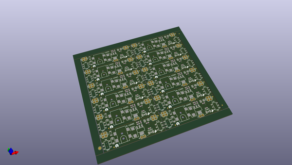
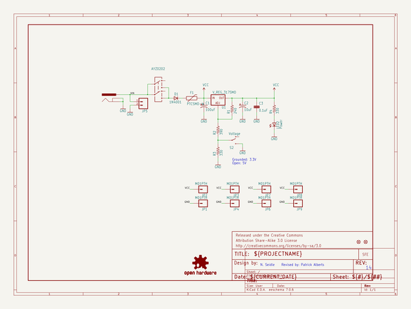
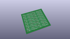
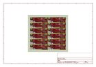
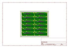
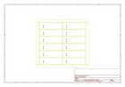
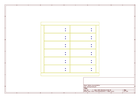
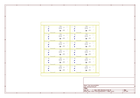

# OOMP Project  
## Breadboard_Power_Supply_Stick_5V-3.3V  by sparkfun  
  
(snippet of original readme)  
  
SparkFun Breadboard Power Supply Stick 5V/3.3V  
===============================================  
  
    
  
[*SparkFun Breadboard Power Supply Stick 5V/3.3V(PRT-13032)*](https://www.sparkfun.com/products/13032)  
  
This is a very simple board that takes a 6-12V input voltage and outputs a selectable 5V or 3.3V regulated voltage.   
All headers are 0.1" pitch for simple insertion into a breadboard.  
  
Repository Contents  
-------------------  
* **/Hardware** - All hardware files for Breadboard Power Supply  
* **/Production** - Test bed files and production panel files  
  
Product Versions  
----------------  
* [PRT-13032](https://www.sparkfun.com/products/13032)- Version 1.4. Currently available.  
* [PRT-10804](https://www.sparkfun.com/products/10804)- Version 1.3. Retired.   
  
Version History  
---------------  
* [v_14](https://github.com/sparkfun/Breadboard_Power_Supply_Stick_5V-3.3V/tree/v_14)- GitHub files, version 1.4  
* [v13](https://github.com/sparkfun/Breadboard_Power_Supply_Stick_5V-3.3V/tree/v13) - GitHub files, version 1.3  
  
License Information  
-------------------  
The hardware is released under [Creative Commons ShareAlike 4.0 International](https://creativecommons.org/licenses/by-sa/4.0/).  
  
Distributed as-is; no warranty is given.  
  
  full source readme at [readme_src.md](readme_src.md)  
  
source repo at: [https://github.com/sparkfun/Breadboard_Power_Supply_Stick_5V-3.3V](https://github.com/sparkfun/Breadboard_Power_Supply_Stick_5V-3.3V)  
## Board  
  
  
## Schematic  
  
  
  
[schematic pdf](working_schematic.pdf)  
## Images  
  
  
  
  
  
  
  
  
  
  
  
  
  
  
  
  
