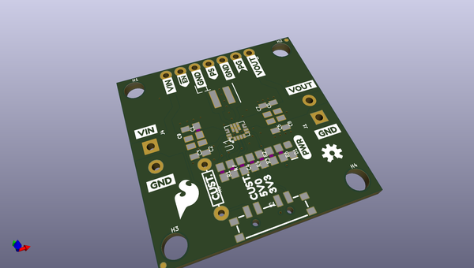
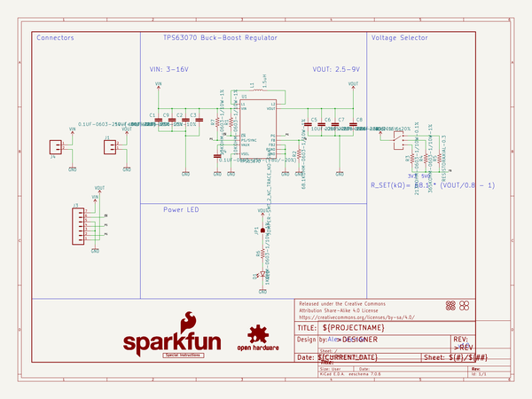

# OOMP Project  
## Buck-Boost  by sparkfun  
  
oomp key: oomp_projects_flat_sparkfun_buck_boost  
(snippet of original readme)  
  
SparkFun Buck-Boost Converter  
========================================  
  
  
  
[*SparkFun Buck-Boost Converter (15208)*](https://www.sparkfun.com/products/15208)  
  
<Basic description of the part.>  
  
Repository Contents  
-------------------  
  
* **/Hardware** - Eagle design files (.brd, .sch)  
  
Documentation  
--------------  
* **[Hookup Guide](https://learn.sparkfun.com/tutorials/buck-boost-hookup-guide)** - Basic hookup guide for the SparkFun Buck-Boost Converter.  
  
License Information  
-------------------  
  
This product is _**open source**_!  
  
Please review the LICENSE.md file for license information.  
  
If you have any questions or concerns on licensing, please contact technical support on our [SparkFun forums](https://forum.sparkfun.com/viewforum.php?f=152).  
  
Distributed as-is; no warranty is given.  
  
- Your friends at SparkFun.  
  
_<COLLABORATION CREDIT>_  
  
  full source readme at [readme_src.md](readme_src.md)  
  
source repo at: [https://github.com/sparkfun/Buck-Boost](https://github.com/sparkfun/Buck-Boost)  
## Board  
  
  
## Schematic  
  
  
  
[schematic pdf](working_schematic.pdf)  
## Images  
