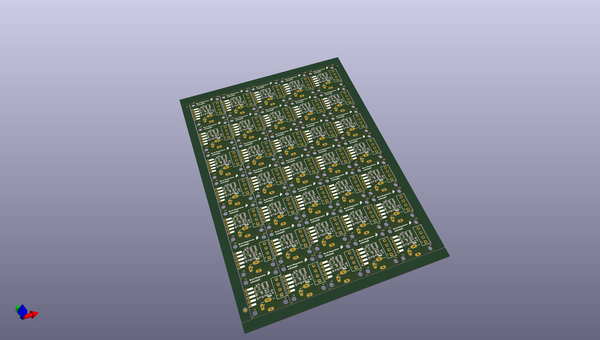
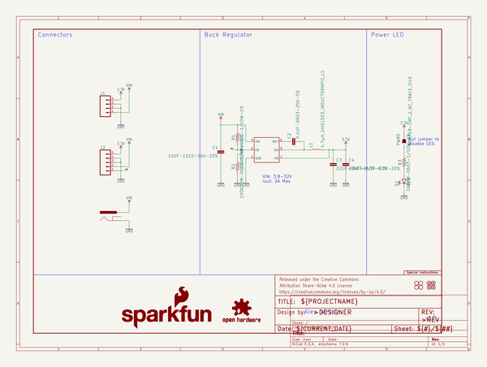

# OOMP Project  
## Buck_Regulator_AP63203  by sparkfun  
  
oomp key: oomp_projects_flat_sparkfun_buck_regulator_ap63203  
(snippet of original readme)  
  
SparkFun Buck Regulator and Baby Buck Regulator  
========================================  
  
<table class="table table-hover table-striped table-bordered">  
    <tr>  
        <th class="text-center">   
        </th>  
        <th class="text-center">  
        </th>  
    </tr>  
    <tr align="center">  
        <td></td>  
        <td></td>  
    </tr>  
    <tr align="center">  
        <td><a href="https://www.sparkfun.com/products/18356">SparkFun Buck Regulator Breakout - 3.3V (AP63203)</a></td>  
        <td><a href="https://www.sparkfun.com/products/18357">BabyBuck Regulator Breakout - 3.3V (AP63203)</a></td>  
    </tr>  
</table>  
  
  
Who doesn't occasionally need power regulation? We certainly do, so we've designed the SparkFun Buck Regulator and Baby Buck Regulator Breakouts to help us with just such a task. Featuring the AP63203 from Diodes Inc, these breakout boards take advantage of a 2A synchronous buck converter that has a wide input voltage range of 3.8V to 32V and fully integrated 125mΩ high-side power MOSFET/68mΩ lowside power MOSFET to provide high-efficiency step-down DC/DC conversion. All of this snuggled up in a low-profil  
  full source readme at [readme_src.md](readme_src.md)  
  
source repo at: [https://github.com/sparkfun/Buck_Regulator_AP63203](https://github.com/sparkfun/Buck_Regulator_AP63203)  
## Board  
  
  
## Schematic  
  
  
  
[schematic pdf](working_schematic.pdf)  
## Images  
