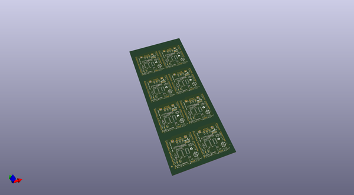

# OOMP Project  
## CAN-Bus_Shield  by sparkfun  
  
(snippet of original readme)  
  
SparkFun CAN-Bus Shield  
==============  
  
  
  
[*SparkFun CAN-BUS Shield (DEV-13262)*](https://www.sparkfun.com/products/13262)  
  
This shield give the Arduino CAN-BUS capability.   
  
Repository Contents  
-------------------  
  
* **/Hardware** - Eagle design files (.brd, .sch)  
* **/Libraries** - Libraries for use with the CAN-Bus Shield.   
* **/Production** - Production panel files (.brd)  
  
  
Documentation  
--------------  
* **[Library](https://github.com/sparkfun/SparkFun_CAN-Bus_Arduino_Library)** - Arduino library for the CAN-Bus.  
* **[Hookup Guide](https://learn.sparkfun.com/tutorials/can-bus-shield-hookup-guide)** - Basic hookup guide for the CAN-Bus.  
* **[SparkFun Fritzing repo](https://github.com/sparkfun/Fritzing_Parts)** - Fritzing diagrams for SparkFun products.  
* **[SparkFun 3D Model repo](https://github.com/sparkfun/3D_Models)** - 3D models of SparkFun products.   
  
Product Versions  
----------------  
* [DEV-13262](https://www.sparkfun.com/products/13262)- Version 1.3. Currently live.   
* [DEV-10039](https://www.sparkfun.com/products/retired/10039)- Version 1.2. Retired.   
  
GitHub Version History  
---------------  
* [V1.3](https://github.com/sparkfun/CAN-Bus_Shield/tree/v1.3) - This is version 1.3 of the shield. Currently live.  
* [V1.2](https://github.com/sparkfun/CAN-Bus_Shield/tree/v1.2) - This is version 1.2 of the shield. Retired  
  
License Information  
-------------------  
  
This product is _**open so  
  full source readme at [readme_src.md](readme_src.md)  
  
source repo at: [https://github.com/sparkfun/CAN-Bus_Shield](https://github.com/sparkfun/CAN-Bus_Shield)  
## Board  
  
  
## Schematic  
  
  
  
[schematic pdf](working_schematic.pdf)  
## Images  
