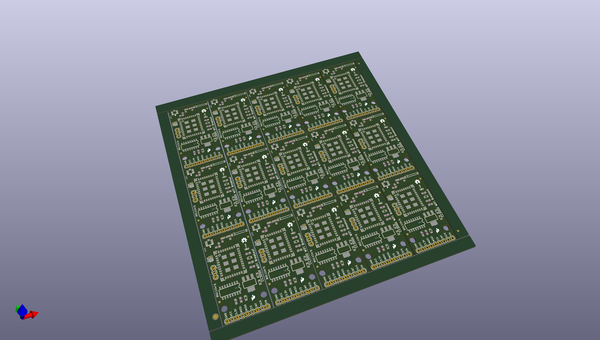
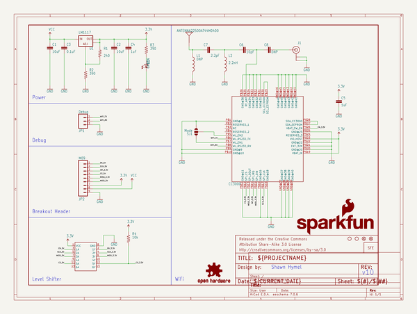

# OOMP Project  
## CC3000_WiFi_Breakout  by sparkfun  
  
(snippet of original readme)  
  
CC3000_WiFi_Breakout  
====================  
  
[    
*CC3000 WiFi Breakout Board (WRL-12072)*](https://www.sparkfun.com/products/12072)  
  
WiFi breakout board for the [TI CC3000 module](http://www.ti.com/product/cc3000). The datasheet can be found [here](http://www.ti.com/lit/ds/symlink/cc3000.pdf).  
  
Arduino library and examples can be found in the [SFE_CC3000_Library](https://github.com/sparkfun/SFE_CC3000_Library).  
  
This part was created in Eagle v6.5.0. Example sketches were created in Arduino v1.0.5.  
  
Repository Contents  
-------------------  
  
* **/Fritzing** - [Fritzing](http://fritzing.org/) part files  
* **/Hardware** - All Eagle design files (.brd, .sch, .STL)  
* **/Production** - Test bed files and production panel files  
  
Version History  
---------------  
* **v1.0** Initial release  
  
License Information  
-------------------  
The hardware is released under [Creative Commons Share-alike 3.0](http://creativecommons.org/licenses/by-sa/3.0/).    
All other code is open source so please feel free to do anything you want with it; you buy me a beer if you use this and we meet someday ([Beerware license](http://en.wikipedia.org/wiki/Beerware)).  
  full source readme at [readme_src.md](readme_src.md)  
  
source repo at: [https://github.com/sparkfun/CC3000_WiFi_Breakout](https://github.com/sparkfun/CC3000_WiFi_Breakout)  
## Board  
  
  
## Schematic  
  
  
  
[schematic pdf](working_schematic.pdf)  
## Images  
