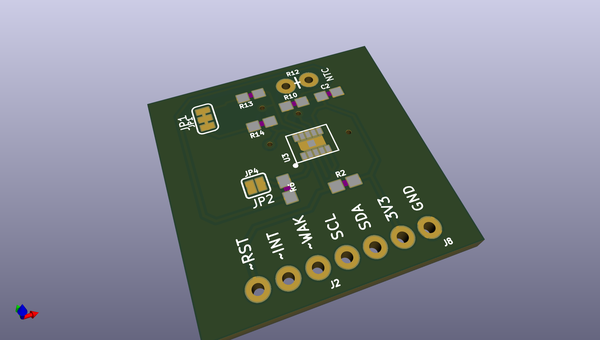
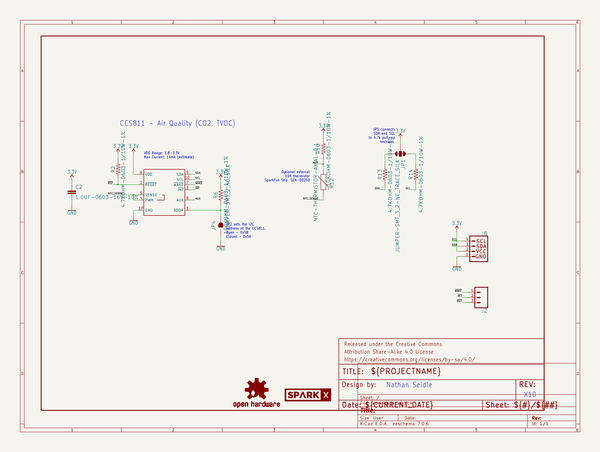
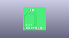
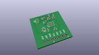
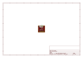
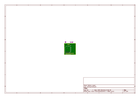
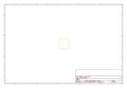
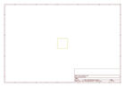
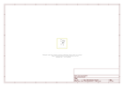

# OOMP Project  
## CCS811_Air_Quality_Breakout  by sparkfun  
  
(snippet of original readme)  
  
SparkFun CCS811 Air Quality Breakout  
========================================  
  
  
  
[*SparkFun CCS811 (SEN-14193)*](https://www.sparkfun.com/products/14193)  
  
The CCS811 is an digital gas sensor solution which integrates a metal oxide (MOX) gas sensor to detect a wide range of Volatile Organic Compounds (VOCs) for indoor air quality monitoring.  
  
This product is designed to provide an easy hardware and software interface to the CCS811 sensor.  
  
Repository Contents  
-------------------  
  
* **/Documentation** - Data sheets, additional product information  
* **/Hardware** - Eagle design files (.brd, .sch)  
* **/Production** - Production panel files (.brd)  
* **/Software** - Python scripts for CCS811  
  
Documentation  
--------------  
* **[Library](https://github.com/sparkfun/SparkFun_CCS811_Arduino_Library)** - Arduino library for the CCS811.  
* **[Hookup Guide](https://learn.sparkfun.com/tutorials/ccs811-air-quality-breakout-hookup-guide)** - Basic hookup guide for the CCS811.  
* **[SparkFun Fritzing repo](https://github.com/sparkfun/Fritzing_Parts)** - Fritzing diagrams for SparkFun products.  
* **[SparkFun 3D Model repo](https://github.com/sparkfun/3D_Models)** - 3D models of SparkFun products.   
  
Product Versions  
----------------  
* [SEN-14193](https://www.sparkfun.com/)- CCS811 Breakout board  
  
Version History  
---------------  
* [V 1.0.0](https://github.com/sparkfun/CCS  
  full source readme at [readme_src.md](readme_src.md)  
  
source repo at: [https://github.com/sparkfun/CCS811_Air_Quality_Breakout](https://github.com/sparkfun/CCS811_Air_Quality_Breakout)  
## Board  
  
  
## Schematic  
  
  
  
[schematic pdf](working_schematic.pdf)  
## Images  
  
  
  
  
  
  
  
  
  
  
  
  
  
  
  
  
