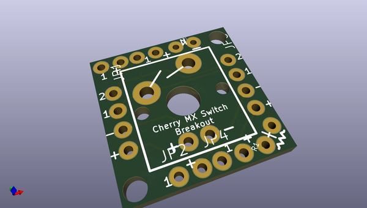
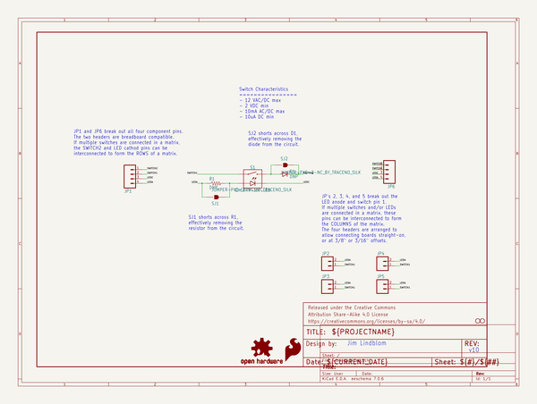
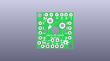
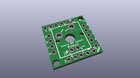
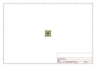
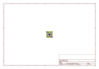
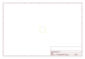
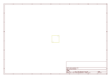
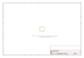

# OOMP Project  
## Cherry_MX_Switch_Breakout  by sparkfun  
  
(snippet of original readme)  
  
SparkFun Cherry MX Switch Breakout  
====================  
  
<table class="table table-hover table-striped table-bordered">  
  <tr align="center">  
   <td></td>  
   <td></td>  
  </tr>  
  <tr align="center">  
    <td><i>SparkFun Cherry MX Switch Breakout </i></td>  
    <td><i>Cherry MX Switch Soldered on Breakout</i></td>  
  </tr>  
</table>  
  
[*SparkFun Cherry MX Switch Breakout (BOB-13773)*](https://www.sparkfun.com/products/13773)  
  
Cherry MX Keyswitches are top-of-the-line mechanical keyboard switches. They’re satisfyingly “clicky”, reliable up to tens-of-millions of key presses, and a standard in gaming and programming keyboards across the globe. With the SparkFun Cherry MX Switch Breakout we have made the switches more easily adaptable to breadboard or perfboard-based projects. The Cherry MX Switch Breakout is a perfect prototyping tool for projects ranging from a single-key user-input to fully-custom 101-key keyboards.  
  
Repository Contents  
-------------------  
  
* **/Hardware** - All Eagle design files (.brd, .sch)  
* **/Production** - Production panel files (.brd)  
  
Documentation  
--------------  
* **[Hookup Guide](https://learn.sparkfun.com/tutorials/cherr  
  full source readme at [readme_src.md](readme_src.md)  
  
source repo at: [https://github.com/sparkfun/Cherry_MX_Switch_Breakout](https://github.com/sparkfun/Cherry_MX_Switch_Breakout)  
## Board  
  
  
## Schematic  
  
  
  
[schematic pdf](working_schematic.pdf)  
## Images  
  
  
  
  
  
  
  
  
  
  
  
  
  
  
  
  
