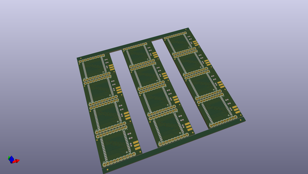
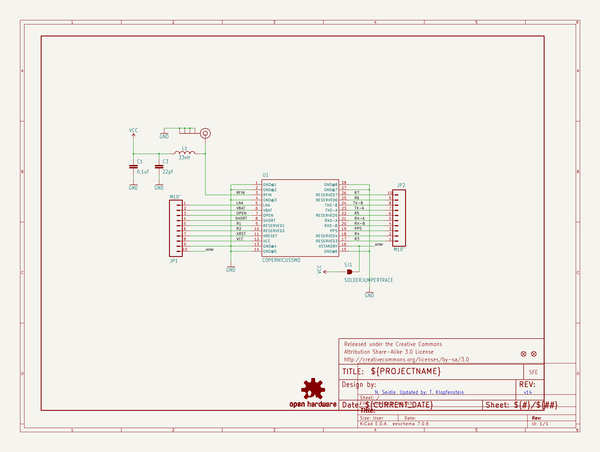
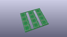
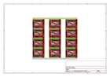
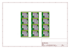
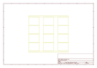
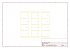
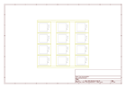

# OOMP Project  
## Copernicus_II_DIP_Module  by sparkfun  
  
oomp key: oomp_projects_flat_sparkfun_copernicus_ii_dip_module  
(snippet of original readme)  
  
Copernicus II DIP Module  
========================  
  
  
  
[*Copernicus II DIP Module (GPS-11858)*](https://www.sparkfun.com/products/11858)  
  
This breakout board allows access to the SMD pins of the Copernicus II GPS module from Trimble.   
  
Repository Contents  
-------------------  
* **/Hardware** - All Eagle design files (.brd, .sch)  
* **/Libraries** - All Arduino libraries and board examples  
* **/Production** - Test bed files and production panel files  
  
Documentation  
-------------------  
* **[Hookup Guide](https://learn.sparkfun.com/tutorials/copernicus-ii-hookup-guide)** - Basic hookup guide  
  
Version History  
---------------  
* [GPS-11067 - v13](https://github.com/sparkfun/Copernicus_II_DIP_Module/tree/79d04dc032e8ecc2a1069bf3677cde6e07c77bf1)  
  
License Information  
-------------------  
The hardware is released under [Creative Commons Share-alike 3.0](http://creativecommons.org/licenses/by-sa/3.0/).   
All other code is open source so please feel free to do anything you want with it; you buy me a beer if you use this and we meet someday ([Beerware license](http://en.wikipedia.org/wiki/Beerware)).  
  
The library was written by @trbabb. The original repository can be found [here](https://github.com/trbabb/copernicus).   
  
  full source readme at [readme_src.md](readme_src.md)  
  
source repo at: [https://github.com/sparkfun/Copernicus_II_DIP_Module](https://github.com/sparkfun/Copernicus_II_DIP_Module)  
## Board  
  
  
## Schematic  
  
  
  
[schematic pdf](working_schematic.pdf)  
## Images  
  
  
  
  
  
  
  
  
  
  
  
  
  
  
  
  
