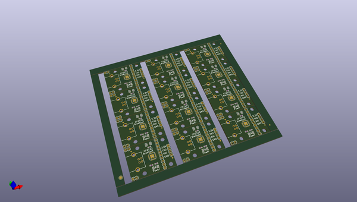
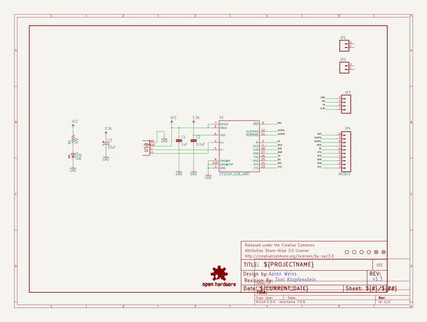
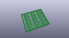
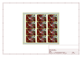
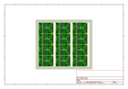
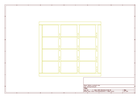
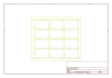
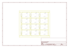

# OOMP Project  
## CP2102_Breakout  by sparkfun  
  
(snippet of original readme)  
  
CP2102 USB to Serial Breakout Board  
===================================  
  
[  
*CP2102 USB to Serial Breakout (BOB-00198)*](https://www.sparkfun.com/products/198)  
  
This breakout board enables you to connect to a standard USB A to B cable and communicate to your microcontroller via serial logic.  
  
  
Repository Contents  
-------------------  
* **/Hardware** - All Eagle design files (.brd, .sch)  
* **/Production** - Test bed files and production panel files  
  
License Information  
-------------------  
The hardware is released under [Creative Commons ShareAlike 4.0 International](https://creativecommons.org/licenses/by-sa/4.0/).  
  
Distributed as-is; no warranty is given.  
  
  full source readme at [readme_src.md](readme_src.md)  
  
source repo at: [https://github.com/sparkfun/CP2102_Breakout](https://github.com/sparkfun/CP2102_Breakout)  
## Board  
  
  
## Schematic  
  
  
  
[schematic pdf](working_schematic.pdf)  
## Images  
  
  
  
  
  
  
  
  
  
  
  
  
  
  
  
  
