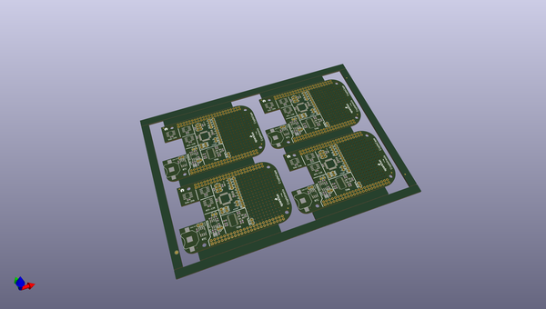
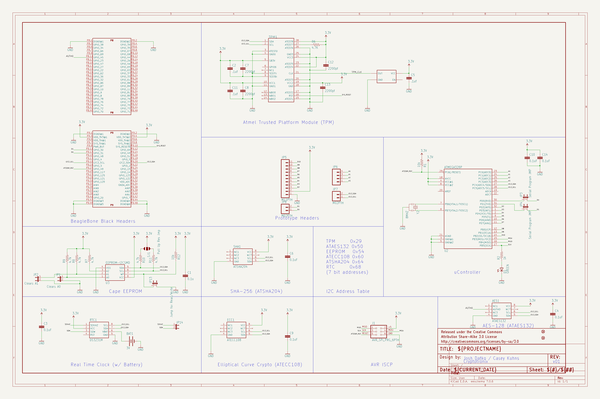

# OOMP Project  
## CryptoCape  by sparkfun  
  
oomp key: oomp_projects_flat_sparkfun_cryptocape  
(snippet of original readme)  
  
CryptoCape  
==========  
  
  
  
[*CryptoCape (DEV-12773)*](https://www.sparkfun.com/products/12773)  
  
A Cryptography Cape for the BeagleBone Black.  
  
Repository Contents  
-------------------  
  
* **/Documentation** - PDF print of the board.  
* **/Hardware** - All Eagle design files (.brd, .sch)  
* **/Production** - Test bed files and production panel files  
  
Documentation  
--------------  
* **[Hookup Guide](https://learn.sparkfun.com/tutorials/cryptocape-hookup-guide)** - Basic hookup guide for the CryptoCape.  
* **[SparkFun Fritzing repo](https://github.com/sparkfun/Fritzing_Parts)** - Fritzing diagrams for SparkFun products.  
* **[SparkFun 3D Model repo](https://github.com/sparkfun/3D_Models)** - 3D models of SparkFun products.   
  
License Information  
-------------------  
  
This product is _**open source**_!   
  
The hardware is released under [Creative Commons Share-alike 3.0](http://creativecommons.org/licenses/by-sa/3.0/).  
  
If you have any questions or concerns on licensing, please contact techsupport@sparkfun.com.  
  
Distributed as-is; no warranty is given.  
  
- Your friends at SparkFun.  
  
_This board is a collaboration with Josh Datko at Cryptotronix._  
  
  full source readme at [readme_src.md](readme_src.md)  
  
source repo at: [https://github.com/sparkfun/CryptoCape](https://github.com/sparkfun/CryptoCape)  
## Board  
  
  
## Schematic  
  
  
  
[schematic pdf](working_schematic.pdf)  
## Images  
