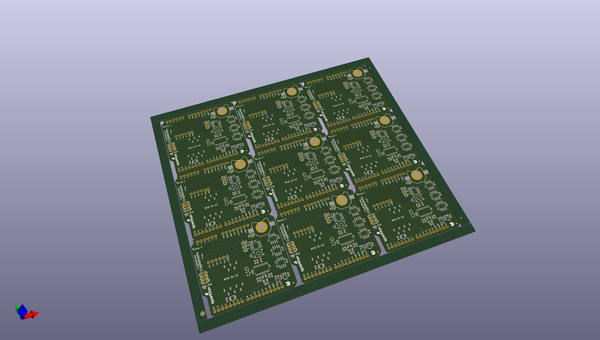
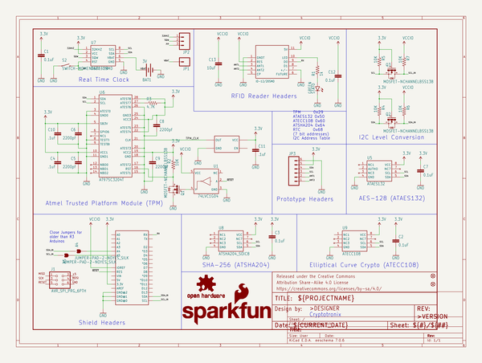
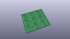
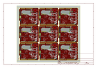
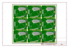
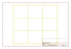
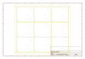
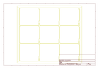
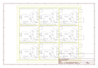

# OOMP Project  
## CryptoShield  by sparkfun  
  
(snippet of original readme)  
  
SparkFun CryptoShield  
=====================  
  
  
  
[*SparkFun CryptoShield (DEV-13183)*](https://www.sparkfun.com/products/13183)  
  
Repository Contents  
-------------------  
  
* **/Hardware** - Eagle design files (.brd, .sch)  
* **/Production** - Production panel files (.brd)  
  
Documentation  
--------------  
  
* **[Hookup Guide](https://learn.sparkfun.com/tutorials/crypto-shield-hookup-guide)** - Basic hookup guide for the CryptoShield.  
* **[SparkFun Fritzing repo](https://github.com/sparkfun/Fritzing_Parts)** - Fritzing diagrams for SparkFun products.  
* **[SparkFun 3D Model repo](https://github.com/sparkfun/3D_Models)** - 3D models of SparkFun products.   
  
  
License Information  
-------------------  
  
This product is _**open source**_!   
  
Please review the LICENSE.md file for license information.   
  
If you have any questions or concerns on licensing, please contact techsupport@sparkfun.com.  
  
Distributed as-is; no warranty is given.  
  
- Your friends at SparkFun.  
  
_A portion of each sale is given back to Josth Datko for continued development of new and exciting Cryptographic tools._  
  full source readme at [readme_src.md](readme_src.md)  
  
source repo at: [https://github.com/sparkfun/CryptoShield](https://github.com/sparkfun/CryptoShield)  
## Board  
  
  
## Schematic  
  
  
  
[schematic pdf](working_schematic.pdf)  
## Images  
  
  
  
  
  
  
  
  
  
  
  
  
  
  
  
  
