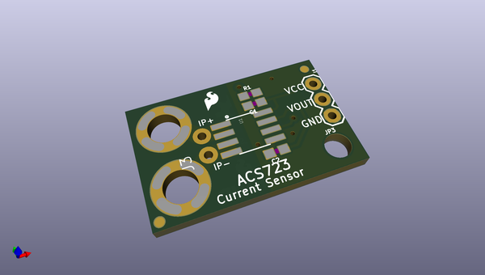
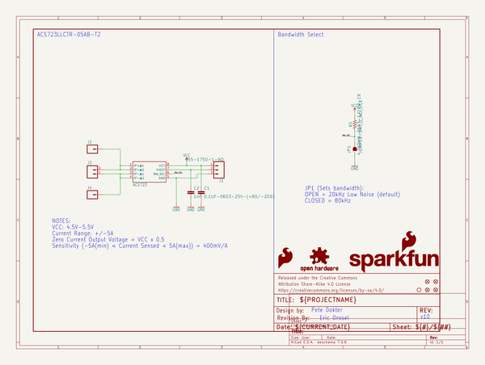

# OOMP Project  
## Current_Sensor_Breakout-ACS723  by sparkfun  
  
oomp key: oomp_projects_flat_sparkfun_current_sensor_breakout_acs723  
(snippet of original readme)  
  
SparkFun Current Sensor Breakout - ACS723  
=====================================================  
  
  
  
[*SparkFun Current Sensor Breakout - ACS723 (SEN-13679)*](https://www.sparkfun.com/products/13679)  
  
The SparkFun Current Sensor Breakout is a high accuracy board that utilizes the ACS723 for moderate AC and DC current sensing applications. The ACS723 sensor uses a Hall effect sensor to output a voltage relative to the current flowing through the IP+ and IP- pins on the board. The advantage of using a Hall effect sensor, specifically, is that the circuit being sensed and the circuit reading the sensor are electrically isolated meaning that, although your Arduino is running on 5V, the sensed circuit can be operating at higher DC or AC voltages!  
  
Repository Contents  
-------------------  
* **/Hardware** - All Eagle design files (.brd, .sch)  
* **/Production** - Production .brd files  
  
Documentation  
-------------------  
* [Hookup Guide](https://learn.sparkfun.com/tutorials/current-sensor-breakout-acs723-hookup-guide) - Basic hookup guide for the ACS723 Current Sensor Breakout  
  
Product Versions  
----------------  
* [SEN-13679](https://www.sparkfun.com/products/13679)- Current ACS723 Version of this Board  
* [SEN-08882 (RETIRED)](https://github.com/sparkfun/Hall-Effect_Current_Sensor_Breakout-ACS712)- In  
  full source readme at [readme_src.md](readme_src.md)  
  
source repo at: [https://github.com/sparkfun/Current_Sensor_Breakout-ACS723](https://github.com/sparkfun/Current_Sensor_Breakout-ACS723)  
## Board  
  
  
## Schematic  
  
  
  
[schematic pdf](working_schematic.pdf)  
## Images  
