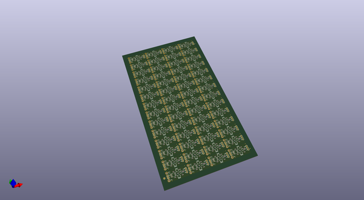
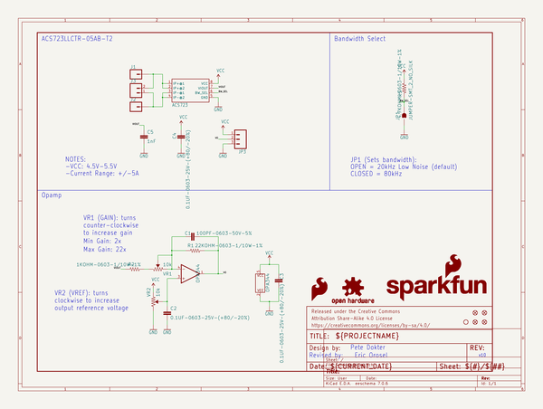
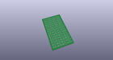
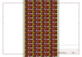
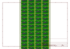
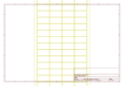
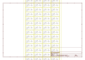

# OOMP Project  
## Current_Sensor_Breakout-ACS723-Low_Current  by sparkfun  
  
(snippet of original readme)  
  
SparkFun Low Current Sensor Breakout Board - ACS723  
======================================================  
  
  
  
[*SparkFun Low Current Sensor Breakout Board - ACS723 (SEN-14544)*](https://www.sparkfun.com/products/14544)   
  
This current sensor gives precise current measurement for both AC and DC signals.   
These are good sensors for metering and measuring overall power consumption of systems.  
The ACS723 Low Current Sensor Breakout outputs an analog voltage that varies linearly with sensed current.  
  
Repository Contents  
-------------------  
* **/Hardware** - All Eagle design files (.brd, .sch)  
* **/Production** - Production .brd files  
* **/Software** - Arduino example sketch  
  
Documentation  
-------------------  
* **[Hookup Guide](https://learn.sparkfun.com/tutorials/current-sensor-breakout-acs723-hookup-guide)** - Basic hookup guide for the ACS723 Current Sensor Breakout (Low Current).  
* **[SparkFun Fritzing repo](https://github.com/sparkfun/Fritzing_Parts)** - Fritzing diagrams for SparkFun products.  
  
Product Versions  
----------------  
* [14544](https://www.sparkfun.com/products/14544)- Current ACS723 (Low Current) Version of this Board  
* [08883 (RETIRED)](https://github.com/sparkfun/Low_Current_Sensor_Breakout-ACS712)- Initial release; ACS712 Version of this Board  
  
License  
  full source readme at [readme_src.md](readme_src.md)  
  
source repo at: [https://github.com/sparkfun/Current_Sensor_Breakout-ACS723-Low_Current](https://github.com/sparkfun/Current_Sensor_Breakout-ACS723-Low_Current)  
## Board  
  
  
## Schematic  
  
  
  
[schematic pdf](working_schematic.pdf)  
## Images  
  
  
  
  
  
  
  
  
  
  
  
  
  
  
  
  
