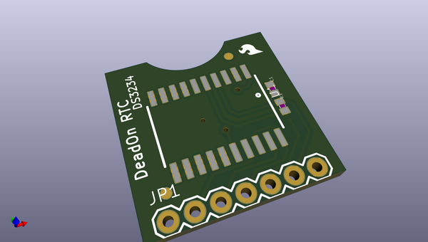
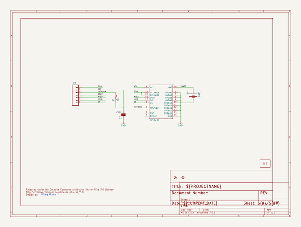
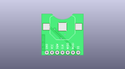
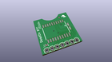
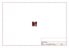
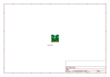
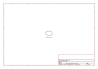
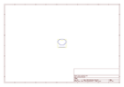
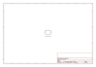
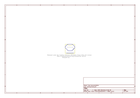

# OOMP Project  
## DeadOn_RTC  by sparkfun  
  
(snippet of original readme)  
  
DeadOn RTC-DS3234 Breakout Board  
==========  
  
   
  
[*DeadOn RTC- DS3234 Breakout (BOB-10160)*](https://www.sparkfun.com/products/10160)  
  
This is a real time clock based on the DS3234 Real Time Clock IC. The DS3234  is a low-cost, extremely accurate SPI bus real-time clock with an integrated temperature-compensated crystal oscillator and crystal.  
  
Repository Contents  
-------------------  
* **/Hardware** - All Eagle design files (.brd, .sch)  
* **/Libraries** - All Arduino libraries and board examples  
  
Version History  
---------------  
  
* [V_1.2.1](https://github.com/sparkfun/DeadOn_RTC/tree/V_1.2.1) - Pulled latest library  
* [V_1.2.0](https://github.com/sparkfun/DeadOn_RTC/tree/V_1.2.0) - Updated to new library structure   
* [V_1.1](https://github.com/sparkfun/DeadOn_RTC/tree/v1.1) - Original structure  
  
License Information  
-------------------  
The hardware is released under [Creative Commons Share-alike 3.0](http://creativecommons.org/licenses/by-sa/3.0/).    
All other code is open source so please feel free to do anything you want with it; you buy me a beer if you use this and we meet someday ([Beerware license](http://en.wikipedia.org/wiki/Beerware)).  
  
  full source readme at [readme_src.md](readme_src.md)  
  
source repo at: [https://github.com/sparkfun/DeadOn_RTC](https://github.com/sparkfun/DeadOn_RTC)  
## Board  
  
  
## Schematic  
  
  
  
[schematic pdf](working_schematic.pdf)  
## Images  
  
  
  
  
  
  
  
  
  
  
  
  
  
  
  
  
