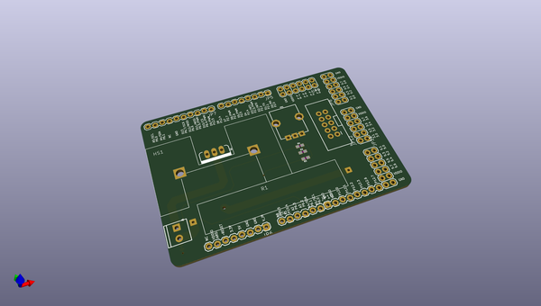
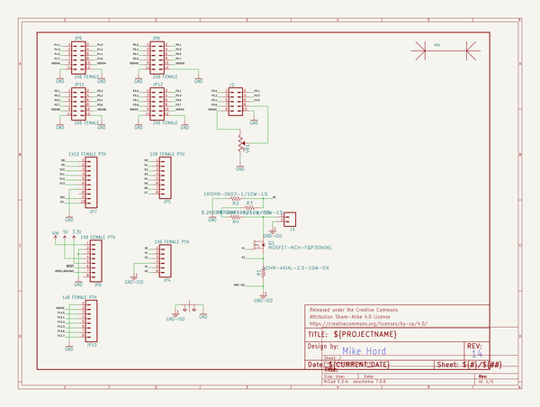
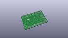
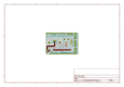
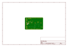
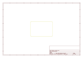
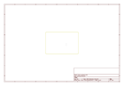
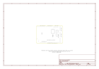

# OOMP Project  
## Digital_Load  by sparkfun  
  
oomp key: oomp_projects_flat_sparkfun_digital_load  
(snippet of original readme)  
  
Digital_Load  
==========================================  
  
  
  
A PSoC-based digital load that allows the user to set a desired current which will be maintained despite changes in voltage supply.  
Check on the [SparkFun Enginursday post](https://www.sparkfun.com/news/2434) about the project build or the [SparkFun Variable Load Kit](https://www.sparkfun.com/products/14449) that uses this design.   
  
License Information  
-------------------  
  
This product is _**open source**_!   
  
Please review the LICENSE.md file for license information.   
  
If you have any questions or concerns on licensing, please contact techsupport@sparkfun.com.  
  
Distributed as-is; no warranty is given.  
  
- Your friends at SparkFun.  
  
  full source readme at [readme_src.md](readme_src.md)  
  
source repo at: [https://github.com/sparkfun/Digital_Load](https://github.com/sparkfun/Digital_Load)  
## Board  
  
  
## Schematic  
  
  
  
[schematic pdf](working_schematic.pdf)  
## Images  
  
  
  
  
  
  
  
  
  
  
  
  
  
  
  
  
