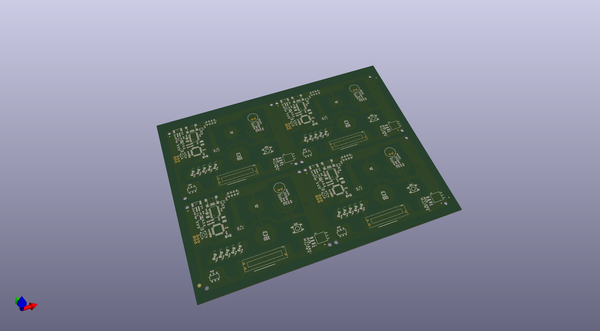
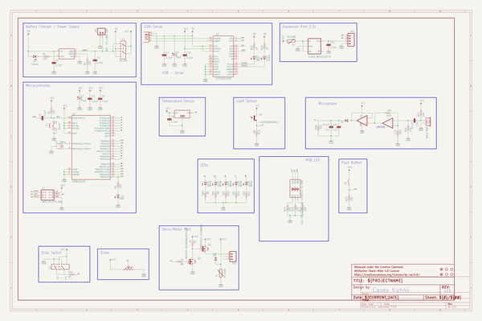
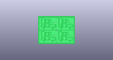
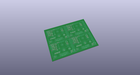
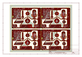
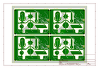
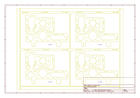
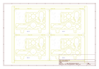
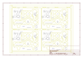

# OOMP Project  
## Digital_Sandbox  by sparkfun  
  
(snippet of original readme)  
  
Digital_Sandbox  
===============  
  
  
  
[*SparkFun Digital Sandbox (SKU)*](https://www.sparkfun.com/products/12651)  
  
he Digital Sandbox (DS) is a learning platform that engages both the software and hardware worlds.  
It’s powered by a microcontroller that can interact with real-world inputs – like light or temperature sensors – while simultaneously controlling LEDs, motors, and other outputs.   
  
Repository Contents  
-------------------  
  
* **/Documentation** - Data files for the Digital Sandbox booklet  
* **/Firmware** - Example code for the Digital Sandbox experiment guide  
* **/Hardware** - Eagle design files (.brd, .sch)  
* **/Production** - Production panel files (.brd)  
  
Documentation  
--------------  
* **[Hookup Guide](https://learn.sparkfun.com/tutorials/digital-sandbox-arduino-companion)** - Basic hookup guide for the Digital SandBox.  
* **[SparkFun Fritzing repo](https://github.com/sparkfun/Fritzing_Parts)** - Fritzing diagrams for SparkFun products.  
* **[SparkFun 3D Model repo](https://github.com/sparkfun/3D_Models)** - 3D models of SparkFun products.  
* **[SparkFun Graphical Datasheets](https://github.com/sparkfun/Graphical_Datasheets)** -Graphical Datasheets for various SparkFun products.  
  
License Information  
-------------------  
  
This product is _**open source**_!  
  
Please review the LICENSE.md file for license information.  
  
If you have any questions or concerns on licensing, please contact tech  
  full source readme at [readme_src.md](readme_src.md)  
  
source repo at: [https://github.com/sparkfun/Digital_Sandbox](https://github.com/sparkfun/Digital_Sandbox)  
## Board  
  
  
## Schematic  
  
  
  
[schematic pdf](working_schematic.pdf)  
## Images  
  
  
  
  
  
  
  
  
  
  
  
  
  
  
  
  
