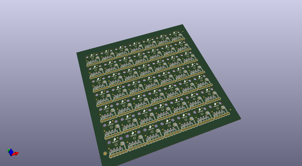
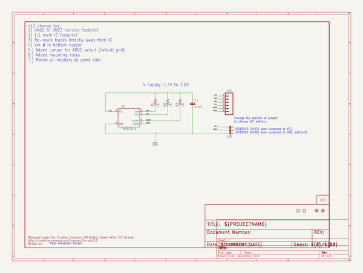
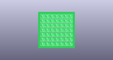
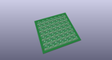
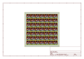
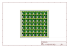
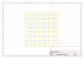
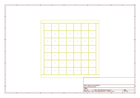
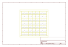

# OOMP Project  
## Digital_Temperature_Sensor_Breakout_-_TMP102  by sparkfun  
  
(snippet of original readme)  
  
Digital Temperature Sensor Breakout - TMP102  
============================================  
  
  
  
[*Digital Temperature Sensor Breakout - TMP102 (SEN-11931)*](https://www.sparkfun.com/products/11931)  
  
Breakout board for TMP102 digital temperature sensor. [The datasheet can be found here.](https://www.sparkfun.com/datasheets/Sensors/Temperature/tmp102.pdf)  
  
This board was created in Eagle v6.4.0.   
  
Repository Contents  
-------------------  
  
* **/Hardware** - All Eagle design files (.brd and .sch)  
* **/Production** - Production panel files  
  
Documentation  
-------------------  
  
* [Arduino Library](https://github.com/sparkfun/SparkFun_TMP102_Arduino_Library)  
* [Hookup Guide](https://learn.sparkfun.com/tutorials/tmp102-digital-temperature-sensor-hookup-guide)  
  
License Information  
-------------------  
The hardware is released under [Creative Commons Share-alike 3.0](http://creativecommons.org/licenses/by-sa/3.0/).    
All other code is open source so please feel free to do anything you want with it; you buy me a beer if you use this and we meet someday ([Beerware license](http://en.wikipedia.org/wiki/Beerware)).  
  
Design by Kade Alexander Jensen  
  
  
  full source readme at [readme_src.md](readme_src.md)  
  
source repo at: [https://github.com/sparkfun/Digital_Temperature_Sensor_Breakout_-_TMP102](https://github.com/sparkfun/Digital_Temperature_Sensor_Breakout_-_TMP102)  
## Board  
  
  
## Schematic  
  
  
  
[schematic pdf](working_schematic.pdf)  
## Images  
  
  
  
  
  
  
  
  
  
  
  
  
  
  
  
  
