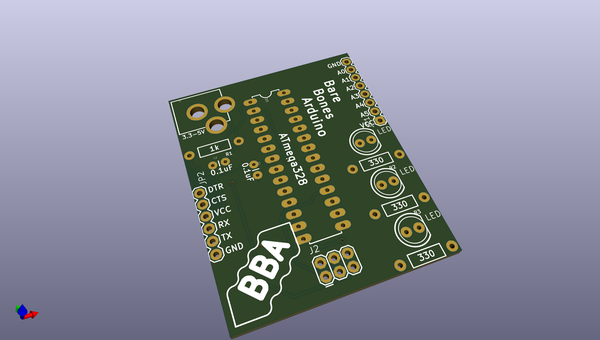
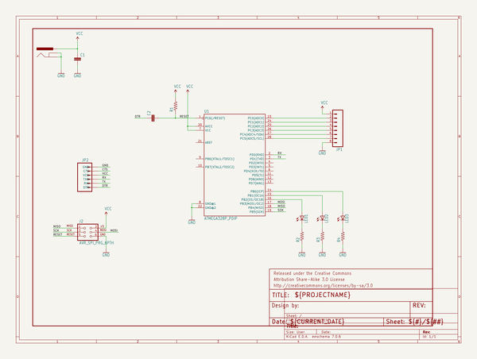

# OOMP Project  
## Eagle_Class_Tools  by sparkfun  
  
(snippet of original readme)  
  
Note: to delete previous settings delete "Cadsoft" folder in "C:\Users\jim.lindblom\AppData\Roaming"  
  
--- Download and Install Eagle  
  
Link: [http://www.cadsoftusa.com/download-eagle/?language=en](http://www.cadsoftusa.com/download-eagle/?language=en)  
  
File Name: eagle-win-6.4.0.exe (Windows), eagle-mac-6.4.0.zip (Mac)  
  
1. Run WinZip Self-Extractor.  
2. Setup (Wait about a minute).  
3. Next on Welcome Screen.  
4. Yes to license agreement.  
5. Decide destination directory, Click Next  
6. Click next to start copying files. Wait a minute.  
7. Select "Run as Freeware". Click Next.  
	* Freeware limitations? !!! TODO  
8. Click Finish.  
  
--- Run Eagle for First Time  
  
Click "Yes" to any/all directory creations  
  
--- Setting Up the Control Panel  
  
1. Overview about each tree.  
	* Click on an example in each tree, and show how information panel changes.  
	* Explain green dots.  
2. Show "Directories" Dialog  
	* Options > Directories  
	* Point Libraries to our library folder (.../Eagle Class Files/lbrClass). In addition to current directory.  
	* Point Scripts to our folder (.../Eagle Class Files/scrClass). In addition to current directory.  
	* Show how lbrClass and scrClass directories are added to tree view.  
3. Set Libraries to USE NONE from default folder. Make sure lbrClass folder is used.  
	* Explain why we won't be using default libraries. Too overwhelming.  
	* Right-click **Libraries** tree, click **Use None**.  
	* Should make all green dots go away.  
	* Talk a bit more about library. Expand and look at   
  full source readme at [readme_src.md](readme_src.md)  
  
source repo at: [https://github.com/sparkfun/Eagle_Class_Tools](https://github.com/sparkfun/Eagle_Class_Tools)  
## Board  
  
  
## Schematic  
  
  
  
[schematic pdf](working_schematic.pdf)  
## Images  
