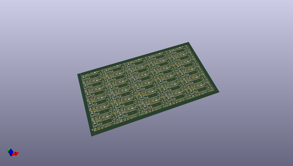
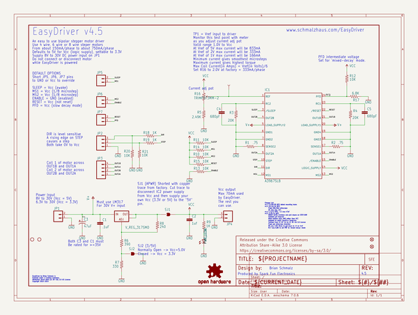
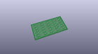
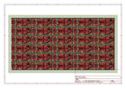
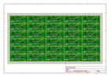
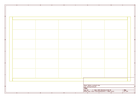
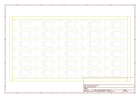
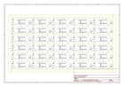

# OOMP Project  
## Easy_Driver  by sparkfun  
  
(snippet of original readme)  
  
Easy Driver  
===========  
  
  
  
[*Easy Driver (ROB-12779)*](https://www.sparkfun.com/products/12779)  
  
  
The EasyDriver is a simple to use stepper motor driver, compatible with anything that can output a digital 0 to 5V pulse (or 0 to 3.3V pulse if you solder SJ2 closed on the EasyDriver).   
The EasyDriver requires a 7V to 20V supply to power the motor and can power any voltage of stepper motor.  
  
  
Repository Contents  
-------------------  
* **/Firmware** - Any firmware that the part ships with,   
* **/Hardware** - All Eagle design files (.brd, .sch, .STL)  
* **/Production** - Test bed files and production panel files  
  
Documentation  
--------------  
  
* **[Hookup Guide](https://learn.sparkfun.com/tutorials/easy-driver-hook-up-guide)** - Basic hookup guide for the Easy Driver.  
* **[Brian Schmalz: Easy Driver](http://schmalzhaus.com/EasyDriver/)** - More specs and FAQ.  
  
  
License Information  
-------------------  
  
_Note: This product is a collaboration with Brian Schmalz. A portion of each sales goes back to him for product support and continued development._  
  
  full source readme at [readme_src.md](readme_src.md)  
  
source repo at: [https://github.com/sparkfun/Easy_Driver](https://github.com/sparkfun/Easy_Driver)  
## Board  
  
  
## Schematic  
  
  
  
[schematic pdf](working_schematic.pdf)  
## Images  
  
  
  
  
  
  
  
  
  
  
  
  
  
  
  
  
