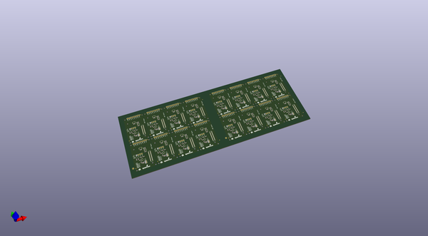

# OOMP Project  
## Edison_ADC_Block  by sparkfun  
  
oomp key: oomp_projects_flat_sparkfun_edison_adc_block  
(snippet of original readme)  
  
SparkFun Block for Intel Edison - ADC  
==================================================  
  
  
  
[*SparkFun Block for Intel Edison - ADC (DEV-13770)*](https://www.sparkfun.com/products/13770)  
  
This card adds ADC functionality to the Edison's I2C bus.   
The ADS1015 ADC from TI provides a single 12-bit delta-sigma convertor with an analog multiplexer.   
It can be configured as a four-channel single-ended device or as a two-channel differential device.  
  
The board has jumpers to allow selection of the I2C slave address among four different options, allowing up to four of these cards to be stacked under one Edison.   
The sampling rate is not sufficient for audio capture, at 2.2kHz, but it should be adequate for most control applications.  
  
Repository Contents  
-------------------  
  
* **/Hardware** - Eagle design files (.brd, .sch)  
* **/Production** - Production panel files (.brd)  
  
Documentation  
--------------  
  
* **[Hookup Guide](https://learn.sparkfun.com/tutorials/sparkfun-blocks-for-intel-edison---adc-v20)** - Basic hookup guide for the Edison ADC Block.  
* **[SparkFun Fritzing repo](https://github.com/sparkfun/Fritzing_Parts)** - Fritzing diagrams for SparkFun products.  
* **[SparkFun 3D Model repo](https://github.com/sparkfun/3D_Models)** - 3D models of SparkFun products.   
  
Version History  
---------------  
* [v21](https://github.com/sparkfun/Edison_ADC_Block/tree/V_2.1  
  full source readme at [readme_src.md](readme_src.md)  
  
source repo at: [https://github.com/sparkfun/Edison_ADC_Block](https://github.com/sparkfun/Edison_ADC_Block)  
## Board  
  
  
## Schematic  
  
  
  
[schematic pdf](working_schematic.pdf)  
## Images  
