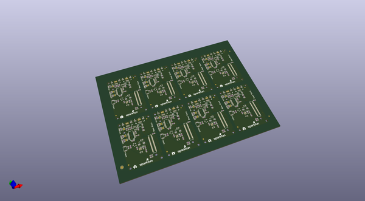

# OOMP Project  
## Edison_Base_Block  by sparkfun  
  
oomp key: oomp_projects_flat_sparkfun_edison_base_block  
(snippet of original readme)  
  
Edison_Mezzanine_Base  
=====================  
  
Base Board for Edison Mezzanine stack  
  
  full source readme at [readme_src.md](readme_src.md)  
  
source repo at: [https://github.com/sparkfun/Edison_Base_Block](https://github.com/sparkfun/Edison_Base_Block)  
## Board  
  
  
## Schematic  
  
  
  
[schematic pdf](working_schematic.pdf)  
## Images  
