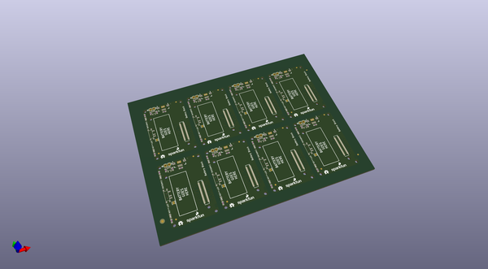

# OOMP Project  
## Edison_Battery_Block  by sparkfun  
  
oomp key: oomp_projects_flat_sparkfun_edison_battery_block  
(snippet of original readme)  
  
SparkFun Block for Intel Edison - Battery/Power  
=================================================  
  
  
  
[*SparkFun Block for Intel Edison - Battery/Power (DEV-13037)*](https://www.sparkfun.com/products/13037)  
  
Go wireless with Edison!    
The Battery board brings a single cell LiPo Charger and 400mah battery to power an Intel Edision and expansion cards.    
The Battery board can be used with an external battery to increase runtime.  Simply plug in a micro USB cable to charge.    
The power switch removes the battery from the Edison while allowing it to charge via the microUSB cable.  
  
Repository Contents  
-------------------  
* **/Hardware** - Eagle design files (.brd, .sch)  
* **/Production** - Production panel files (.brd)  
  
Documentation  
--------------  
* **[Hookup Guide](https://learn.sparkfun.com/tutorials/sparkfun-blocks-for-intel-edison---battery-block)** - Basic hookup guide for the battery/power block.  
* **[SparkFun Fritzing repo](https://github.com/sparkfun/Fritzing_Parts)** - Fritzing diagrams for SparkFun products.  
* **[SparkFun 3D Model repo](https://github.com/sparkfun/3D_Models)** - 3D models of SparkFun products.   
  
Product Versions  
----------------  
* [Battery Block](https://www.sparkfun.com/products/13037)- Battery block.  
* [Power Block](https://www.sparkfun.com/products/13727)- Battery block without lipo battery installed.   
  
License Information  
-----------------  
  full source readme at [readme_src.md](readme_src.md)  
  
source repo at: [https://github.com/sparkfun/Edison_Battery_Block](https://github.com/sparkfun/Edison_Battery_Block)  
## Board  
  
  
## Schematic  
  
  
  
[schematic pdf](working_schematic.pdf)  
## Images  
