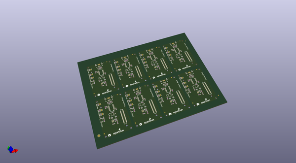

# OOMP Project  
## Edison_Console_Block  by sparkfun  
  
(snippet of original readme)  
  
Console  
=====================  
  
The Console expansion board delivers power to the Intel Edison while providing a simple console interface.  This is a minimal solution to get started using the Intel Edison.  The Console board can supply 4V and up to 1.5A of current to power the Edison and any other expansion boards you may add to your stack. This power is passed through the VSYS line of the Edison.  
  
  full source readme at [readme_src.md](readme_src.md)  
  
source repo at: [https://github.com/sparkfun/Edison_Console_Block](https://github.com/sparkfun/Edison_Console_Block)  
## Board  
  
  
## Schematic  
  
  
  
[schematic pdf](working_schematic.pdf)  
## Images  
