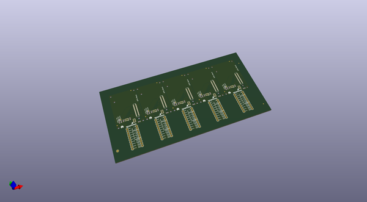

# OOMP Project  
## Edison_GPIO_Block  by sparkfun  
  
oomp key: oomp_projects_flat_sparkfun_edison_gpio_block  
(snippet of original readme)  
  
SparkFun Edison GPIO Breakout  
=============================  
  
  
  
[*SparkFun Edison GPIO Breakout(DEV-13038)*](https://www.sparkfun.com/products/13038)  
  
The GPIO Breakout is a simple breakout board to bring the GPIO from the Intel Edison to the user.  Bread board friendly, the GPIO provides level-shifted access to all basic GPIO, PWM, and UART2. GPIO may be set to VSYS or 3.3v levels. The GPIO Breakout also provides access to all three power rails found on the Intel Edison.  3.3v, 1.8v, VSYS, and GND are accessable for bread board prototyping.  
  
Repository Contents  
-------------------  
* **/Hardware** - All Eagle design files (.brd, .sch)  
* **/Production** - TEst bed files and production panel files  
  
License Information  
-------------------  
  
The hardware is released under [Creative Commons ShareAlike 4.0 International](https://creativecommons.org/licenses/by-sa/4.0/).  
The code is beerware; if you see me (or any other SparkFun employee) at the local, and you've found our code helpful, please buy us a round!  
  
Distributed as-is; no warranty is given.  
  
  full source readme at [readme_src.md](readme_src.md)  
  
source repo at: [https://github.com/sparkfun/Edison_GPIO_Block](https://github.com/sparkfun/Edison_GPIO_Block)  
## Board  
  
  
## Schematic  
  
  
  
[schematic pdf](working_schematic.pdf)  
## Images  
