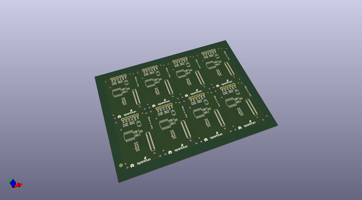

# OOMP Project  
## Edison_H-Bridge_Block  by sparkfun  
  
(snippet of original readme)  
  
Dual H-bridge  
=====================  
  
The Dual H-bridge give the Edison some ability to move when paired with two DC motors.  This board can drive two DC motors at voltages ranging from 2.7V-15V and currents up to 1amp.  This board is isolated from the Edison using a logic level converter.  To use this board external power for the motors will be required.  Power for the motors is supplied on the headers labled "VIN" and "GND"  
  
  full source readme at [readme_src.md](readme_src.md)  
  
source repo at: [https://github.com/sparkfun/Edison_H-Bridge_Block](https://github.com/sparkfun/Edison_H-Bridge_Block)  
## Board  
  
  
## Schematic  
  
  
  
[schematic pdf](working_schematic.pdf)  
## Images  
