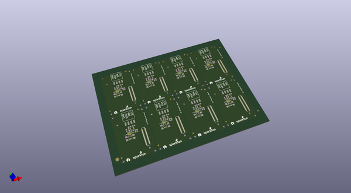

# OOMP Project  
## Edison_I2C_Breakout_Block  by sparkfun  
  
(snippet of original readme)  
  
SparkFun Edison I2C Breakout Block  
==================================  
  
  
  
[*SparkFun Edison I2C Breakout Block(DEV-13034)*](https://www.sparkfun.com/products/13034)  
  
This I2C Block simply breaks out an I2C bus on the Intel® Edison while level shifting it from 1.8V to your sensors voltage. This a simple board that can snap into your Edison and be used right away.  
  
Repository Contents  
-------------------  
* **Hardware** - All Eagle diesgn files (.brd, .sch)  
* **/Production** - Test bed files and production panel files  
  
License Information  
-------------------  
The hardware is released under [Creative Commons ShareAlike 4.0 International](https://creativecommons.org/licenses/by-sa/4.0/).  
The code is beerware; if you see me (or any other SparkFun employee) at the local, and you've found our code helpful, please buy us a round!  
  
Distributed as-is; no warranty is given.  
  
  full source readme at [readme_src.md](readme_src.md)  
  
source repo at: [https://github.com/sparkfun/Edison_I2C_Breakout_Block](https://github.com/sparkfun/Edison_I2C_Breakout_Block)  
## Board  
  
  
## Schematic  
  
  
  
[schematic pdf](working_schematic.pdf)  
## Images  
