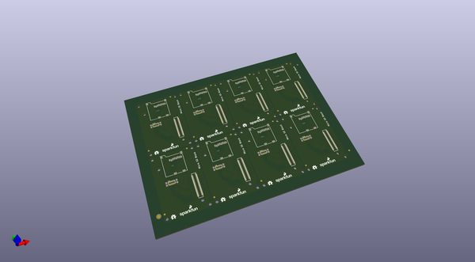

# OOMP Project  
## Edison_Micro_SD_Block  by sparkfun  
  
oomp key: oomp_projects_flat_sparkfun_edison_micro_sd_block  
(snippet of original readme)  
  
SparkFun Edison microSD Block  
============================  
  
  
  
[*SparkFun Edison microSD Block(DEV-13041)*](https://www.sparkfun.com/products/13041)  
  
The microSD Block equips your Edioson with mass storage capability, so you can use it for data-logging or other related projects.  
  
Repository Contents  
-------------------  
* **/Hardware** - All Eagle Design files (.brd, .sch)  
* **/Production** -Test bed files and production panel files  
  
License Information  
-------------------  
  
The hardware is released under [Creative Commons ShareAlike 4.0 International](https://creativecommons.org/licenses/by-sa/4.0/).  
The code is beerware; if you see me (or any other SparkFun employee) at the local, and you've found our code helpful, please buy us a round!  
  
Distributed as-is; no warranty is given.  
  
  
  full source readme at [readme_src.md](readme_src.md)  
  
source repo at: [https://github.com/sparkfun/Edison_Micro_SD_Block](https://github.com/sparkfun/Edison_Micro_SD_Block)  
## Board  
  
  
## Schematic  
  
  
  
[schematic pdf](working_schematic.pdf)  
## Images  
