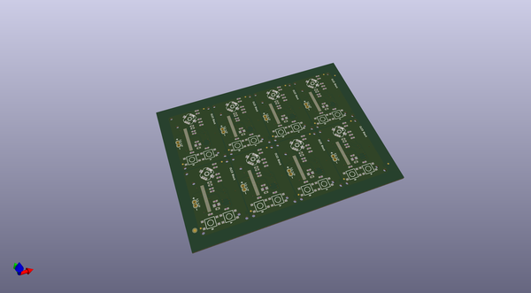

# OOMP Project  
## Edison_OLED_Block  by sparkfun  
  
oomp key: oomp_projects_flat_sparkfun_edison_oled_block  
(snippet of original readme)  
  
SparkFun Edison OLED Block  
===========================  
  
  
  
[*SparkFun Edison OLED Block(DEV-13035)*](https://www.sparkfun.com/products/13035)  
  
Equip your Edison with a graphic display using the Edison OLED board! This board features a 0.66", 64x48 pixel monochrome OLED.  
  
To add some control over your Edison and the OLED, this board also includes a small joystick and a pair of push-buttons. Use them to create a game, file navigator, or more!  
  
Repository Contents  
-------------------  
* **/Firmware** - Example Pong sketch to demonstrate OLED Functionality.   
* **/Hardware** - All Eagle design files (.brd, .sch)  
* **/Production** - Test bed files and production panel files  
  
Documentation  
--------------  
* **[Hookup Guide](https://learn.sparkfun.com/tutorials/sparkfun-blocks-for-intel-edison---oled-block)** - Basic hookup guide for the OLED Block.  
* **[SparkFun Fritzing repo](https://github.com/sparkfun/Fritzing_Parts)** - Fritzing diagrams for SparkFun products.  
* **[SparkFun 3D Model repo](https://github.com/sparkfun/3D_Models)** - 3D models of SparkFun products.   
* **[SparkFun Graphical Datasheets](https://github.com/sparkfun/Graphical_Datasheets)** -Graphical Datasheets for various SparkFun products.  
  
  
License Information  
-------------------  
  
This product is _**open source**_!   
  
Please review the LICENSE.md file for license information.   
  
If you have any questions or concerns on licensing,   
  full source readme at [readme_src.md](readme_src.md)  
  
source repo at: [https://github.com/sparkfun/Edison_OLED_Block](https://github.com/sparkfun/Edison_OLED_Block)  
## Board  
  
  
## Schematic  
  
  
  
[schematic pdf](working_schematic.pdf)  
## Images  
