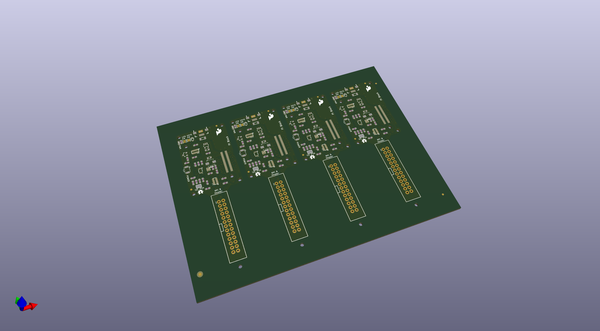

# OOMP Project  
## Edison_Pi_Block  by sparkfun  
  
(snippet of original readme)  
  
SparkFun Edison Pi Block  
========================  
  
  
  
[*SparkFun Edison Pi Block (DEV-13044)*](https://www.sparkfun.com/products/13044)  
  
The Pi Block is a simple breakout board to bring the GPIO from the Intel Edison to the user. The Block provides level-shifted access to basic GPIO, PWM, UART, I2C, and SPI. The pins are presented in the same configuration as a [Raspberry Pi Model B header](http://elinux.org/RPi_Low-level_peripherals-Model_A_and_B_.28Original.29).  
  
Access to the GPIO pins can be accomplished through [MRAA](https://github.com/intel-iot-devkit/mraa). The GPIO number listed on the board or Linux is not the same as MRAA. Refer to the table to see which GPIO pin maps to which number in MRAA.   
  
*MRAA pin map table based on [Intel's IOT Dev Kit Repository](https://github.com/intel-iot-devkit/mraa/blob/master/docs/edison.md)*  
  
*Pins on the Pi Block are denoted with a * after the GP number*  
  
<table class="table table-bordered">  
<thead><tr><th class="text-center" title="Field -1">Edison Pin (Linux)</th>  
<th class="text-center" title="Field -2">Arduino Breakout</th>  
<th class="text-center" title="Field -3">Mini Breakout</th>  
<th class="text-center" title="Field -4">MRAA Number</th>  
<th class="text-center" title="Field -5">Pinmode0</th>  
<th class="text-center" title="Field -6">Pinmode1</th>  
<th class="text-center" title="Field -7">Pinmode2</th>  
</tr></thead>  
<tbody><tr cla  
  full source readme at [readme_src.md](readme_src.md)  
  
source repo at: [https://github.com/sparkfun/Edison_Pi_Block](https://github.com/sparkfun/Edison_Pi_Block)  
## Board  
  
  
## Schematic  
  
  
  
[schematic pdf](working_schematic.pdf)  
## Images  
