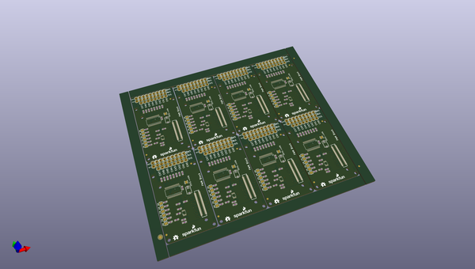

# OOMP Project  
## Edison_PWM_Block  by sparkfun  
  
(snippet of original readme)  
  
SparkFun Edison PWM Block  
==================================================  
  
  
  
[*SparkFun Edison PWM Block(DEV-13042)*](https://www.sparkfun.com/products/13042)  
  
  
This card adds eight channels of PWM control to the Edison's I2C bus. While the PWM output can be used for any generic PWM application, it is specifically intended to provide drive control for up to eight standard hobby-type servo motors. To that end, it has an independent input for supply voltage for the servos above the normal range of the Edison, and 8 connections that support the most common pinout of hobby servo motors.  
  
The PCA9685 provides open-collector or push-pull output capabilities; as the intended target is servo motors, the board has a pull-up resistor to the independently connected servo supply voltage. The PCA9685 has an independent clock that can be operated at 50Hz, for servo control; at that frequency, the 12-bit resolution of the device provides approximately 200 steps of resolution for a servo motor.  
  
The PCA9685 can be used as an open collector current driver for LEDs up to 25mA as well. Six solder jumpers allow the user to attach up to 63 of these cards to a single Edison, or to adjust the address of the PCA9685 to avoid collision with other addresses on the bus.  
  
Repository Contents  
-------------------  
* **/Hardware** - All Eagle design files (.brd, .sch)  
* **/Production** - Test bed files a  
  full source readme at [readme_src.md](readme_src.md)  
  
source repo at: [https://github.com/sparkfun/Edison_PWM_Block](https://github.com/sparkfun/Edison_PWM_Block)  
## Board  
  
  
## Schematic  
  
  
  
[schematic pdf](working_schematic.pdf)  
## Images  
