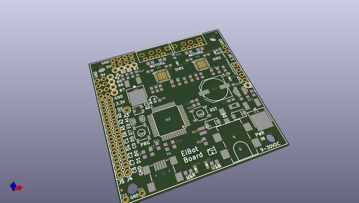
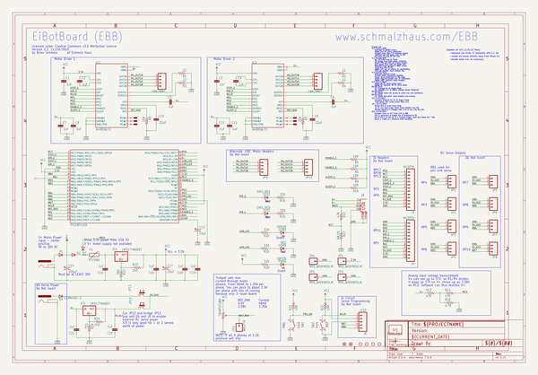
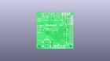
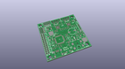
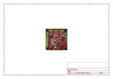
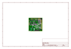
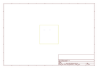
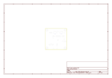
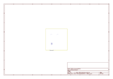
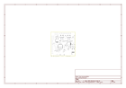

# OOMP Project  
## EiBotBoard  by sparkfun  
  
(snippet of original readme)  
  
EiBotBoard  
==========  
  
  
[*EiBotBoard (WIG-10025)*](https://www.sparkfun.com/products/10025)  
  
The EiBotBoard (EBB) was originally designed for the Egg-Bot project.   
It is a small (2.2" x 2.2") two channel stepper motor driver board with USB microcontroller.   
It is based on the UBW board and supports all of the commands that the UBW does (for the most part), plus several extra, like stepper motor commands and RC servo output commands.  
  
Repository Contents  
-------------------  
* **/Hardware** - All Eagle design files (.brd, .sch)  
  
License Information  
-------------------  
Distributed as-is; no warranty is given.  
  
_**Note:** This product is a collaboration with Brian Schmalz. A portion of each sales goes back to him for product support and continued development._  
  full source readme at [readme_src.md](readme_src.md)  
  
source repo at: [https://github.com/sparkfun/EiBotBoard](https://github.com/sparkfun/EiBotBoard)  
## Board  
  
  
## Schematic  
  
  
  
[schematic pdf](working_schematic.pdf)  
## Images  
  
  
  
  
  
  
  
  
  
  
  
  
  
  
  
  
