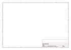
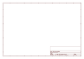

# OOMP Project  
## Electret_Microphone_Breakout  by sparkfun  
  
(snippet of original readme)  
  
Electret Microphone Breakout  
============================  
  
  
[*SparkFun Electret Microphone (BOB-09964)*](https://www.sparkfun.com/products/9964)  
  
This small breakout board couples a small electret microphone   
with a 100x opamp to amplify the sounds of voice, door knocks,   
etc loud enough to be picked up by a microcontroller’s Analog to Digital converter.   
  
  
Repository Contents  
-------------------  
* **/Hardware** - All Eagle design files (.brd, .sch)  
  
License Information  
-------------------  
The hardware is released under [Creative Commons ShareAlike 4.0 International](https://creativecommons.org/licenses/by-sa/4.0/).  
The code is beerware; if you see me (or any other SparkFun employee) at the local, and you've found our code helpful, please buy us a round!  
  
Distributed as-is; no warranty is given.  
  
  full source readme at [readme_src.md](readme_src.md)  
  
source repo at: [https://github.com/sparkfun/Electret_Microphone_Breakout](https://github.com/sparkfun/Electret_Microphone_Breakout)  
## Board  
  
  
## Schematic  
  
  
  
[schematic pdf](working_schematic.pdf)  
## Images  
  
  
  
  
  
  
  
  
  
  
  
  
  
  
  
  
