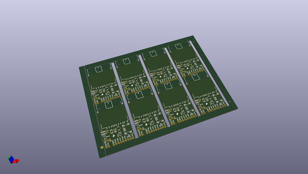
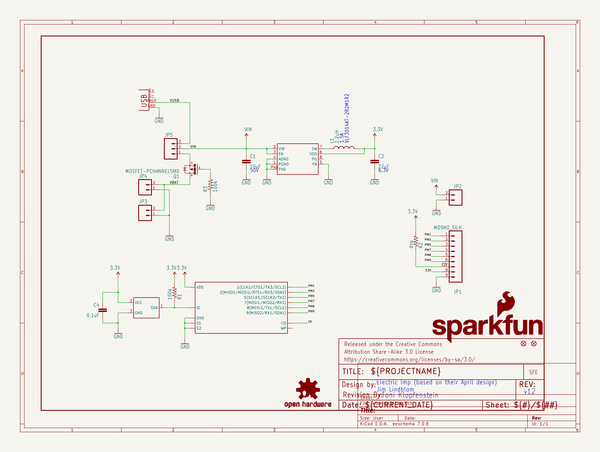
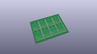
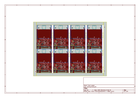
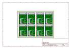
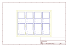
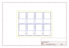
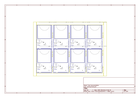

# OOMP Project  
## Electric_Imp_Breakout  by sparkfun  
  
(snippet of original readme)  
  
Electric Imp Breakout  
=====================  
  
[  
*Electric Imp Breakout (BOB-12886)*](https://www.sparkfun.com/products/12886)  
  
The Electric Imp Breakout Board allows you to explore the capabilities of the Imp by providing standard 0.1" headers to solder  
as well as the necessary CryptAuthEE IC to identify your prototype to the Imp Cloud service.   
  
Repository Contents  
-------------------  
* **/Hardware** - All Eagle design files (.brd, .sch)  
* **/Production** - Test bed files and production panel files  
  
Product Versions  
----------------  
* [BOB-11400](https://www.sparkfun.com/products/11400)- Version 1.1 for sale on SparkFun.   
  
Version History  
---------------  
* [v1.1](https://github.com/sparkfun/Electric_Imp_Breakout/tree/V_1.1) Version 1.1 of the Imp Breakout, with the old SD socket footprint.  
  
License Information  
-------------------  
The hardware is released under [Creative Commons ShareAlike 4.0 International](https://creativecommons.org/licenses/by-sa/4.0/).  
  
Distributed as-is; no warranty is given.  
  full source readme at [readme_src.md](readme_src.md)  
  
source repo at: [https://github.com/sparkfun/Electric_Imp_Breakout](https://github.com/sparkfun/Electric_Imp_Breakout)  
## Board  
  
  
## Schematic  
  
  
  
[schematic pdf](working_schematic.pdf)  
## Images  
  
  
  
  
  
  
  
  
  
  
  
  
  
  
  
  
