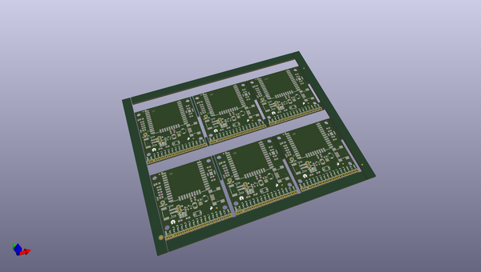
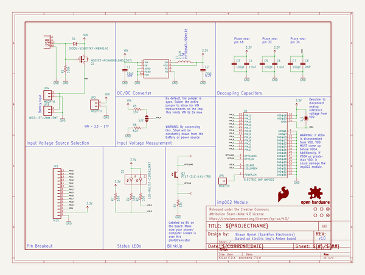
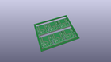
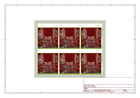
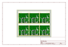
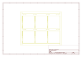
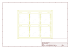
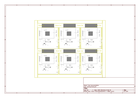

# OOMP Project  
## Electric_Imp_imp002_Breakout  by sparkfun  
  
(snippet of original readme)  
  
SparkFun Electric Imp imp002 Breakout  
============================  
  
  
  
[*Electric Imp imp002 Breakout (BOB-12958)*](https://www.sparkfun.com/products/12958)  
  
The imp002 is a surface mount Electric Imp module with its own breakout board and more pins than the original imp001 card.  
  
  
Repository Contents  
-------------------  
* **/Documentation** - SVG files of the board layout.  
* **/Hardware** - Eagle PCB layout files  
* **/Production** - Files to support SparkFun production  
  
Documentation  
--------------  
  
* **[Hookup Guide](https://learn.sparkfun.com/tutorials/electric-imp-breakout-hookup-guide)** - Basic hookup guide  
  
Product Versions  
----------------  
  
* [BOB-12958](https://www.sparkfun.com/products/12958)- Hardware version 1.0.   
  
Version History  
---------------  
  
License Information  
-------------------  
  
This product is _**open source**_!   
  
Please review the LICENSE.md file for license information.   
  
If you have any questions or concerns on licensing, please contact techsupport@sparkfun.com.  
  
Distributed as-is; no warranty is given.  
  
- Your friends at SparkFun.  
  
  full source readme at [readme_src.md](readme_src.md)  
  
source repo at: [https://github.com/sparkfun/Electric_Imp_imp002_Breakout](https://github.com/sparkfun/Electric_Imp_imp002_Breakout)  
## Board  
  
  
## Schematic  
  
  
  
[schematic pdf](working_schematic.pdf)  
## Images  
  
  
  
  
  
  
  
  
  
  
  
  
  
  
  
  
