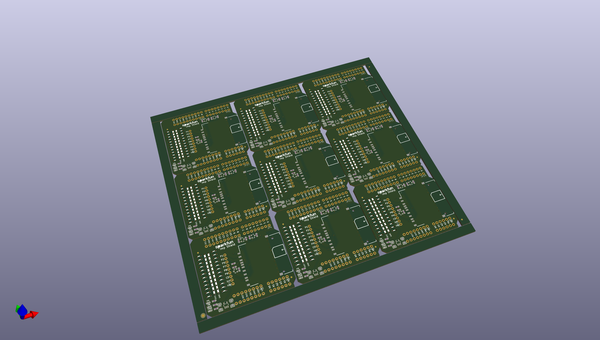
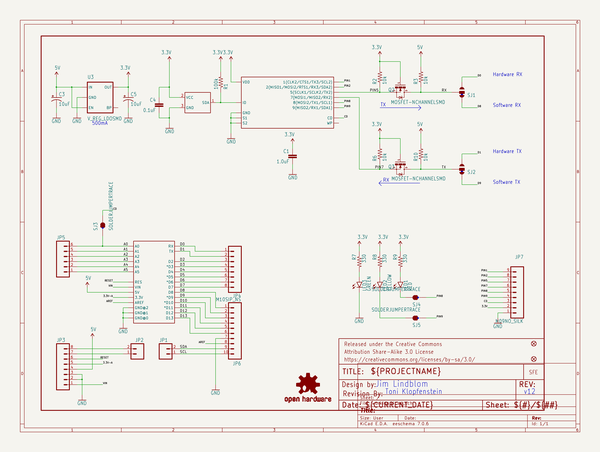
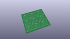
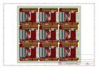
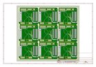
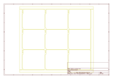
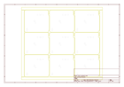
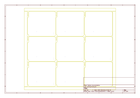
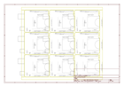

# OOMP Project  
## Electric_Imp_Shield  by sparkfun  
  
(snippet of original readme)  
  
Electric Imp Shield  
===================  
  
[  
*Electric Imp Shield (DEV-12887)*](https://www.sparkfun.com/products/12887)  
  
The Electric Imp shield allows you to connect your Arduino to the Imp Cloud Service and connect to HTTP APIs.   
  
  
Repository Contents  
-------------------  
* **/Hardware** - All Eagle design files (.brd, .sch)  
* **/Production** - Test bed files and production panel files  
  
Product Versions  
----------------  
* [DEV-11401](https://www.sparkfun.com/products/retired/11401)- Version 1.1. Designed for Uno (not R3). Retired.   
  
Version History  
---------------  
* [v1.1](https://github.com/sparkfun/Electric_Imp_Shield/tree/V_1.1) Version 1.1  
  
License Information  
-------------------  
The hardware is released under [Creative Commons ShareAlike 4.0 International](https://creativecommons.org/licenses/by-sa/4.0/).The code is beerware; if you see me (or any other SparkFun employee) at the local, and you've found our code helpful, please buy us a round!  
  
Distributed as-is; no warranty is given.  
  
  
  full source readme at [readme_src.md](readme_src.md)  
  
source repo at: [https://github.com/sparkfun/Electric_Imp_Shield](https://github.com/sparkfun/Electric_Imp_Shield)  
## Board  
  
  
## Schematic  
  
  
  
[schematic pdf](working_schematic.pdf)  
## Images  
  
  
  
  
  
  
  
  
  
  
  
  
  
  
  
  
