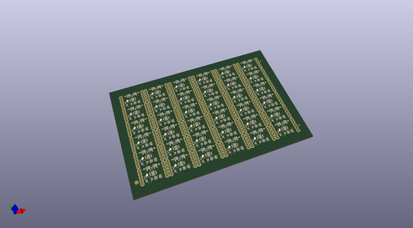
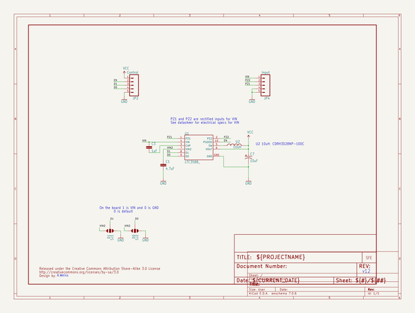
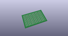
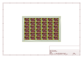
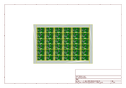
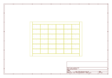
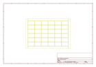
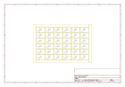

# OOMP Project  
## Energy_Harvester_Breakout-LTC3588  by sparkfun  
  
(snippet of original readme)  
  
SparkFun Energy Harvester Breakout - LTC3588  
========================================  
  
  
  
[*SparkFun Energy Harvester Breakout - LTC3588 (BOB-09946)*](https://www.sparkfun.com/products/9946)  
  
This breakout board uses the LTC3588 Piezoelectric Energy Harvester from Linear Technologies.   
This board can be used not only for harvesting piezoelectric energy, but solar energy as well.   
There is a bridge rectified input for piezo elements (PZ1 and PZ2) and a direct input (VIN) for DC sources.   
Both are clamped to 20V.   
In addition, the board can simply be used as a standalone nanopower buck regulator.  
  
Repository Contents  
-------------------  
  
* **/Hardware** - Eagle design files (.brd, .sch)  
* **/Production** - Production panel files (.brd)  
  
Documentation  
--------------  
* **[SparkFun Fritzing repo](https://github.com/sparkfun/Fritzing_Parts)** - Fritzing diagrams for SparkFun products.  
* **[SparkFun 3D Model repo](https://github.com/sparkfun/3D_Models)** - 3D models of SparkFun products.   
  
  
License Information  
-------------------  
This product is _**open source**_!   
  
The **hardware** is released under [Creative Commons ShareAlike 4.0 International](https://creativecommons.org/licenses/by-sa/4.0/).  
  
Please use, reuse, and modify these files as you see fit. Please maintain attribution to SparkFun Electronics and release anything derivative under the same license.  
  
Distributed as-i  
  full source readme at [readme_src.md](readme_src.md)  
  
source repo at: [https://github.com/sparkfun/Energy_Harvester_Breakout-LTC3588](https://github.com/sparkfun/Energy_Harvester_Breakout-LTC3588)  
## Board  
  
  
## Schematic  
  
  
  
[schematic pdf](working_schematic.pdf)  
## Images  
  
  
  
  
  
  
  
  
  
  
  
  
  
  
  
  
