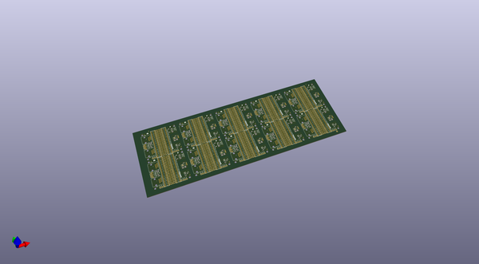
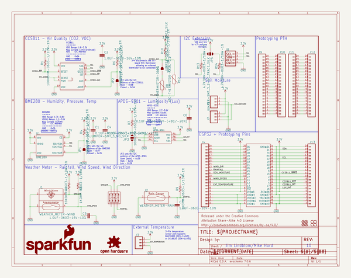
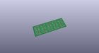
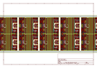
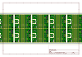
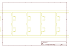
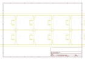
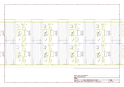

# OOMP Project  
## ESP32_Environment_Sensor_Shield  by sparkfun  
  
oomp key: oomp_projects_flat_sparkfun_esp32_environment_sensor_shield  
(snippet of original readme)  
  
SparkFun ESP32 Environment Sensor Shield  
========================================  
  
  
  
[*SparkFun ESP32 Thing Environment Sensor Shield (DEV-14153)*](https://www.sparkfun.com/products/14153)  
  
The SparkFun ESP32 Thing Environment Sensor Shield provides sensors and hookups for monitoring environmental conditions. While incorporating three sensors capable of measuring five different environmental variables as well as providing connections for several other sensors, this sensor shield creates the best way to make your ESP32 Thing more accurate than your local weatherman!  
  
Repository Contents  
-------------------  
  
* **/Documentation** - Data sheets, additional product information  
* **/Firmware** - Example code   
* **/Hardware** - Eagle design files (.brd, .sch)  
* **/Production** - Production panel files (.brd)  
  
Version History  
---------------  
* [v_H1.0](https://github.com/sparkfun/ESP32_Environment_Sensor_Shield/tree/v_H1.0) - Initial release  
  
  
License Information  
-------------------  
  
This product is _**open source**_!   
  
Please review the LICENSE.md file for license information.   
  
If you have any questions or concerns on licensing, please contact techsupport@sparkfun.com.  
  
Distributed as-is; no warranty is given.  
  
- Your friends at SparkFun.  
  
_<COLLABORATION CREDIT>_  
  
  full source readme at [readme_src.md](readme_src.md)  
  
source repo at: [https://github.com/sparkfun/ESP32_Environment_Sensor_Shield](https://github.com/sparkfun/ESP32_Environment_Sensor_Shield)  
## Board  
  
  
## Schematic  
  
  
  
[schematic pdf](working_schematic.pdf)  
## Images  
  
  
  
  
  
  
  
  
  
  
  
  
  
  
  
  
