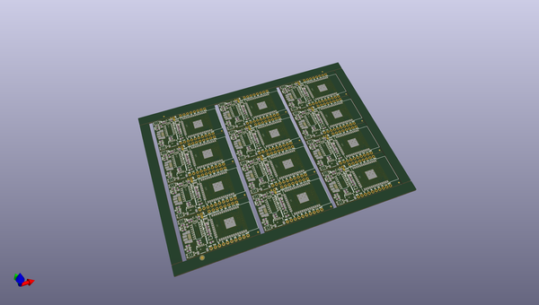
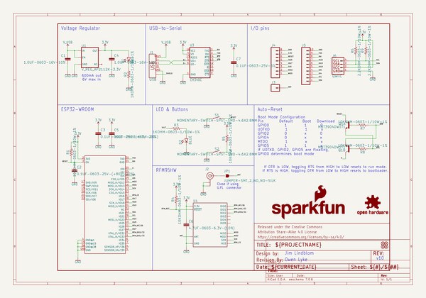

# OOMP Project  
## ESP32_LoRa_1Ch_Gateway  by sparkfun  
  
(snippet of original readme)  
  
SparkFun LoRa Gateway 1-Channel  
========================================  
  
  
  
[*SparkFun LoRa Gateway 1-Channel (15006)*](https://www.sparkfun.com/products/15006)  
  
A programmable microcontroller featuring both WiFi and Bluetooth radios -- with an RFM95W LoRa transceiver to create a single-channel LoRa gateway. It's a perfect, low-cost tool for monitoring a dozen-or-so LoRa devices, and relaying their messages up to the cloud.  
  
Repository Contents  
-------------------  
  
* **/Documentation** - Data sheets, additional product information  
* **/Firmware** - Example code   
* **/Hardware** - Eagle design files (.brd, .sch)  
  
Documentation  
--------------  
* **[Library](https://github.com/sparkfun/ESP32_LoRa_1Ch_Gateway)** - Arduino library for the SparkFun LoRa Gateway 1-Channel.  
* **[Hookup Guide](https://learn.sparkfun.com/tutorials/sparkfun-lora-gateway-1-channel-hookup-guide)** - Basic hookup guide for the SparkFun LoRa Gateway 1-Channel.  
* **[SparkFun Fritzing repo](https://github.com/sparkfun/Fritzing_Parts)** - Fritzing diagrams for SparkFun products.  
  
Product Versions  
----------------  
* [15006](https://www.sparkfun.com/products/15006) - SparkFun LoRa Gateway 1-Channel  
  
Version History  
---------------  
* [v10](https://github.com/sparkfun/ESP32_LoRa_1Ch_Gateway/releases/tag/v10) - Initial redboard release  
  
  
  
License Information  
-------------------  
  
T  
  full source readme at [readme_src.md](readme_src.md)  
  
source repo at: [https://github.com/sparkfun/ESP32_LoRa_1Ch_Gateway](https://github.com/sparkfun/ESP32_LoRa_1Ch_Gateway)  
## Board  
  
  
## Schematic  
  
  
  
[schematic pdf](working_schematic.pdf)  
## Images  
