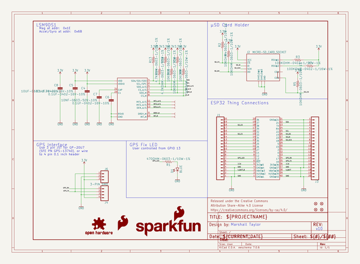
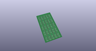
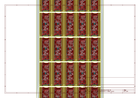
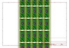
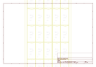
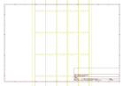
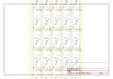

# OOMP Project  
## ESP32_Motion_Shield  by sparkfun  
  
(snippet of original readme)  
  
SparkFun <PRODUCT NAME>  
========================================  
  
  
  
The [ESP32 Thing Motion Shield](https://www.sparkfun.com/products/14430) is a versatile addition to our [ESP32 Thing](https://www.sparkfun.com/products/13907).  Small movements can be detected with the tried and true LSM9DS1 IMU, large movements and time can be detected with the addition of a GPS sensor.  There's a port for the [GP-20U7](https://www.sparkfun.com/products/13740) module, and breakout pins for any serial device.  Data can be easily logged by adding an microSD card to the slot.  There is also an additional user led on pin 13.  
  
Repository Contents  
-------------------  
  
* **/Documentation** - Test plan and record.  
* **/Hardware** - Eagle design files (.brd, .sch)  
* **/Production** - Production panel files (.brd)  
* **/Software** - Example programs for the ESP32 that can support functions of the Motion Shield.  These are used in the hookup guide.  
  
Documentation  
--------------  
* **[Motion Shield Hookup Guide](https://learn.sparkfun.com/tutorials/esp32-thing-motion-shield-hookup-guide)** - Basic hookup guide for the ESP32 Motion Shield.  
* **[ESP32 Hookup Guide](https://learn.sparkfun.com/tutorials/esp32-thing-hookup-guide)** - Basic hookup guide for the ESP32 Thing.  
  
Product Versions  
----------------  
* [DEV-14430](https://www.sparkfun.com/products/14430) - ESP32 Motion Shield  
  
Version History  
---------------  
* [V_1  
  full source readme at [readme_src.md](readme_src.md)  
  
source repo at: [https://github.com/sparkfun/ESP32_Motion_Shield](https://github.com/sparkfun/ESP32_Motion_Shield)  
## Board  
  
  
## Schematic  
  
  
  
[schematic pdf](working_schematic.pdf)  
## Images  
  
  
  
  
  
  
  
  
  
  
  
  
  
  
  
  
